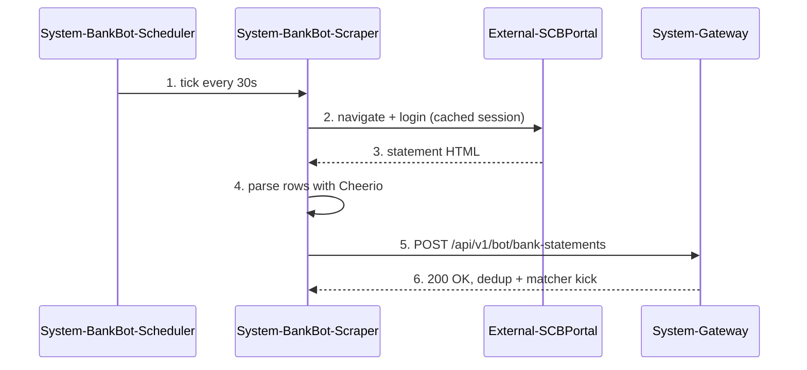

# Workflow 8 — Flow Map (bank-bot side, behavior-level spec with sequence diagram)

> Reference document for the `technical-writer` instance operating inside `github.com/kokarat/bank-bot`.
> Read this file before running the workflow. Do not skim.

W8 sits at a different layer than W1/W2. Those are **code → doc** (code is truth, doc is a claim about code). W8 is **intent → code** (intent is the claim, code is the verification target). The direction of citation flips, and so does the discipline.

W8 on the bank-bot side carries one extra obligation beyond W8 on the pg-writer side: **every bot-owned flow spans two repos by nature** (the bot exists *because* something on mobiz-payment-gateway invokes it or consumes it), so every bank-bot W8 pass is a cross-repo pass. The `#cross-repo-sync` discipline is not optional — it is what turns a pair of single-repo docs into a searchable ecosystem.

Output of a successful W8 pass: a markdown file in `docs/flows/<slug>.md` containing a mermaid sequence diagram plus prose, every numbered sequence step carrying an `// impl:` pointer (or `// ext: kokarat/mobiz-payment-gateway` or `[UNIMPLEMENTED]`/`[DRIFT]` with a paired learning), a W8 trace in Oracle, a reciprocal `#cross-repo-sync` breadcrumb learning that names the mobiz counterpart, a ratification thread for reverse-engineered flows, a validated post-pass self-test proving the two-way link survives `arra_search`, and `docs/flows/.baseline` seeded on the first pass.

---

## When to run this workflow

Run when **any one** of:

- A human explicitly asks to document a bot-side flow ("document the SCB approver flow", "เขียน flow OTP ให้หน่อย").
- A mobiz-side W8 has landed a `#cross-repo-sync + bank-bot` breadcrumb learning naming an expected counterpart slug — that's the senior side saying "your turn." Find these via `arra_search query="cross-repo-sync bank-bot flow:<slug>" type=learning`.
- A W1 or W2 pass on this repo surfaced a bot-owned code path that isn't covered by any existing `flows/*.md` AND crosses an actor boundary (bank portal, mobiz API, admin UI). Internal helpers don't qualify.
- Monthly audit reveals a bot-facing endpoint (inbound HTTP from mobiz) or a scheduled bot scraper with no flow doc.

Do **not** run:

- To document an internal helper (belongs in `current-system.md`, not a flow).
- To describe a target-system flow.
- To edit an existing `flows/*.md` purely from code changes when authoritative claims exist — open an `arra_thread` against the ADR/claim first.
- When the claim source for a **new** flow is only a PR body with no ADR, no human thread answer, and no mobiz-side breadcrumb — first seek a stronger claim (see §Claim strength hierarchy).

---

## Preconditions

- [ ] `git status --porcelain` empty.
- [ ] `docs/.baseline` exists and is parsable (W1 must have run on bank-bot).
- [ ] If `docs/flows/.baseline` exists, it is parsable (informational — tells you when the whole flow portfolio was last verified by W9). If absent, this W8 pass will create it in Step 9a.
- [ ] Oracle reachable (thread authoring + cross-repo-sync discipline require it).
- [ ] At least **40 min** if reverse-engineering, **20 min** if transcribing from a ratified ADR/thread.
- [ ] You can name the flow in one sentence. If you cannot, the scope is too broad — split first.
- [ ] **Cross-repo check ran:** `arra_search query="cross-repo-sync <slug>" type=learning` executed and the result read. If a mobiz-side breadcrumb exists for this slug, it is pinned — this W8 pass must align with the step numbering and actor list the mobiz side declared.

---

## Inputs you will read

1. The named flow (slug + short description). When a mobiz-side breadcrumb exists, reuse the same slug verbatim — **never invent a parallel name**.
2. The claim source(s), in order of strength (§Claim strength hierarchy below).
3. `docs/current-system.md` (bank-bot side) sections covering the scraper / adapter / scheduler code path the flow traverses.
4. The Node.js source files implementing each sequence step — typically under `banks/<bank>/`, `services/`, `scheduler/`, `helpers/`, and the Playwright entry points — for `// impl:` pointers and behavior verification.
5. Existing docs under `docs/flows/` (for house-style consistency).
6. Oracle:
   - `arra_search query="<slug> cross-repo-sync" type=learning` — any mobiz-side breadcrumb anchoring this flow.
   - `arra_search query="technical-writer flow <slug> repo:bank-bot" type=all` — prior bot-side work on this slug.
   - `arra_trace_list query="<slug>" queryType="pattern" limit=5` — prior W8 trace heads (bot or mobiz).
7. Any open threads with `flow:<slug>` in the title. These include cross-repo ratification threads filed from the mobiz side that expect bot-side engagement.

---

## Outputs you will produce

Required:

- `docs/flows/<slug>.md` with all nine sections listed in §Document structure.
- Every numbered step in the mermaid diagram has either an `// impl: <path>@<short>` pointer, **or** `// ext: kokarat/mobiz-payment-gateway` (mobiz-owned territory), **or** `// ext: <bank-portal>` (external bank UI with no code on our side), **or** is explicitly marked `[UNIMPLEMENTED]` / `[DRIFT]` with a paired `arra_learn`.
- At least one `arra_learn` tagged `technical-writer + repo:bank-bot + current + flow + <slug>` with trace id.
- **Reciprocal `#cross-repo-sync` breadcrumb** (Step 9b) — mandatory for every bot-side W8 pass, naming the mobiz counterpart slug and the mobiz W8 trace id (if one exists) or `#cross-repo-sync-bot-first` (if the bot pass is authoring this flow before mobiz).
- W8 root trace opened at Step 2b with `queryType="pattern"`; per-step children for every `[UNIMPLEMENTED]` / `[DRIFT]`.
- A one-line cross-link added to the relevant `current-system.md` section: `**Flow:** [<slug>](flows/<slug>.md)`.
- **Self-test passed** (Step 9c) — the three cross-repo queries defined below all return the new learning(s), and `arra_trace_get <bot-W8-trace>` returns `foundLearnings` that include the reciprocal breadcrumb.

Conditionally produced:

- `arra_thread`(s) for each open question (Step 7). For a **reverse-engineered** flow, one ratification thread is mandatory.
- `arra_supersede` against prior flow learning(s) when this pass revises an existing bot-side flow.

Never produced in this workflow:

- Code changes. Even typo fixes in comments. W8 is doc-only.
- A new ADR. If the flow requires an architectural decision, pause W8 and escalate to the decision-writer / human.
- Duplicate content that should live in `current-system.md`. Flow docs describe *what the system does for the actor*; `current-system.md` describes *how the code is shaped*.
- **A solo bot-side W8 without the reciprocal breadcrumb.** A bot-side flow doc that doesn't tell the ecosystem "this connects to mobiz at X, Y, Z" is a half-closed loop — worse than no doc because it accumulates the same orphan-coverage problem that made this workflow necessary.

---

## Document structure (the nine sections of `flows/<slug>.md`)

1. **Header** — slug, one-sentence purpose, claim-strength label (see §Claim strength hierarchy), ratification marker if reverse-engineered, **cross-repo counterpart** line pointing at `mobiz-payment-gateway/docs/flows/<slug>.md` (if one exists) or `[CROSS-REPO: mobiz counterpart not yet authored]`.
2. **Purpose** — one paragraph at the intent level. "Bank bot authorises a withdrawal transfer via the bank's web portal" **not** "Playwright clicks the approve button."
3. **Actors** — bulleted list. Each actor has a role tag: `User`, `System:<name>`, `External:<name>`. The same names must appear verbatim in the sequence diagram. For bot flows, `System:BankBot` is almost always one of the actors; `External:<BankPortal>` (SCB, KTB, KBank, etc.) typically another; `System:Gateway` (mobiz) a third when the flow crosses.
4. **Preconditions** — one line each. What must be true before the flow starts (bank session state, cron cadence, queued work, BOT_SECRET configured).
5. **Sequence** — mermaid `sequenceDiagram`. Numbered messages (`1.`, `2.`, …). No more than ~10 actor-crossing messages.
6. **Success criteria** — observable and testable. "Transfer appears in bank statement within 30 s, `ts_withdrawal_queue.status = success`" **not** "bot is happy".
7. **Error paths** — bulleted list. Each item names the error class + originating step + observable consequence. Bot-specific classes: `SESSION_EXPIRED`, `CAPTCHA_REQUIRED`, `POPUP_BLOCKED`, `OTP_TIMEOUT`, `AMBIGUOUS_APPROVAL_ROW`.
8. **Postconditions** — state after successful completion. One line each. Typically covers both the bot-side (scraper cursor advanced, session cookie refreshed) and the implications for mobiz state (statements pushed, queue item resolved).
9. **Implementation pointers** — per numbered step, a line linking the step to `path:line@commit-short`. `// ext:` / `[UNIMPLEMENTED]` / `[DRIFT]` markers go here too, each with a paired learning link where applicable.

Headers at fixed casing. No decorative prose between sections. The document is both human- and agent-parseable.

---

## Design notes (read before drafting)

Two observations from empirical W8 passes that shape how to scope + structure a bot-side flow doc. Neither is a hard rule — both are mental models that keep a first-time author from fighting the format.

### Decomposition asymmetry (1:N step expansion at cross-repo boundaries)

Observed empirically on the first bot W8 pass (`scb-dual-control-withdrawal`, 2026-04-19): mobiz-side `withdrawal-queue-dispatch-and-claim.md` step 5 was a single `// ext: kokarat/bank-bot` line — one marker saying "bot does the transfer, not our concern." The bot-side W8 on the same conceptual operation unpacked step 5 into **8 of 11 total bot steps** (steps 2, 3, 5, 6, 8, 8a, 9b, 9c). A 1:8 expansion ratio for a single boundary step.

This is not a bug in either doc. It is the natural shape of an abstraction boundary:

- **Caller / consumer side** (mobiz here) sees a black box at the boundary. The contract is what matters — payload in, payload out, failure modes. Internal mechanics are explicitly not its territory.
- **Implementor / provider side** (bot here) *is* the internals. What the caller sees as one marker is the whole subject of the implementor's flow doc.

Same pattern as any client-library relationship: caller writes `db.Query(sql)` — one line — while the engine behind `Query` is thousands of lines of parse + plan + optimize + execute. Both are "the same operation" at one level of abstraction and radically different at another. The asymmetry is information-theoretic, not a writing flaw.

**What this means for scoping at Step 2:**

- Expect **1:N expansion** at every `// ext:` boundary on the sibling's flow, where N is typically 5-10 on the consumer/implementor side. If the sibling has 7 numbered steps and one of them is `// ext: kokarat/bank-bot`, anticipate that your bot-side flow will end up with roughly 11-14 steps, not 7.
- Step count mismatch between siblings is not evidence the boundary is wrong. It is evidence the abstraction is doing its job.
- The sibling's breadcrumb tells you *where* the boundary is (which of its steps is yours). It does not tell you *how many* of your steps will cover that boundary — that is determined by your territory's mechanics.

**Anti-patterns to avoid:**

- ❌ Compress the bot doc to match the mobiz step count. Loses real content that downstream readers need.
- ❌ Inflate the mobiz doc to match bot granularity. Exposes internals that should stay opaque from the caller's perspective.
- ❌ Panic during Step 2 when the bot flow feels "too big relative to what mobiz said." The W8 spec's 6-10 actor-crossing cap is on the bot flow's own story, not on the ratio between sibling docs.

**Useful framing for the reciprocal breadcrumb in Step 9b:** when writing the breadcrumb body, explicitly name the expansion: *"mobiz's step 5 unpacks into our steps 2, 3, 5, 6, 8, 8a, 9b, 9c."* Future readers jumping between the two docs benefit from seeing the mapping stated, not inferred.

### Loop representation — linear vs `loop`-wrapped (decision framework)

Bank-bot code is mostly long-lived process: schedulers tick, queue consumers claim-process-release, scrapers poll. A flow doc can represent this in two ways, and the choice has structural consequences the spec didn't previously call out.

**Linear (document one iteration, loop nature in prose):** numbered steps 1..N flow top-to-bottom; loop cadence / backoff / init phase live in `§Preconditions`, `§Postconditions`, and arrow-label prose. This is what the 2026-04-19 `scb-dual-control-withdrawal` first draft did.

**Loop-wrapped:** same numbered steps, but wrapped in explicit Mermaid `loop <condition>` and `alt/else` blocks. Init phase sits before the outer `loop`; per-iteration work sits inside it; periodic / post-batch actions sit after it.

Rendered side-by-side on the same underlying flow (see the retro for `scb-dual-control-withdrawal` and the PR #73 preview), the two produce visually very different docs:

| Aspect | Linear | Loop-wrapped |
|---|---|---|
| Height (rendered) | Compact (~300px for 11 steps) | ~2× taller due to nested blocks |
| Loop visibility | Invisible — reads as one-shot | Explicit container, reader sees "bot runs this forever" |
| Init vs iteration | Mixed in sequence | Separated (init before `loop`, iteration inside) |
| Empty-queue / backoff branch | Not shown in diagram | `alt Queue empty / else` visible |
| Nested polling (e.g. OTP every 10s) | Prose in one step's arrow label | Nested `loop` block, unfolded visually |
| Mapping to `// impl:` pointers | Easier — flat 1:1 numbering | Hierarchical — sub-steps (8a, 8b) need sub-pointers |
| 10-crossing cap pressure | Higher — compressed steps aggregate sub-actions | Lower — loop blocks don't consume crossing slots, sub-actions can unfold |
| Reader mental model | "one request path" | "process lifetime" |

**When to use loop-wrapping:**

- Cadence, backoff, or empty-case behavior is correctness-relevant (queue-claim loops, approver polling, session-refresh schedulers).
- A step contains a nested polling / retry loop of its own (OTP polling at step 8a is the canonical case).
- Init and steady-state phases differ enough that mixing them flattens a real structural distinction (long-lived Playwright session + per-batch work).
- A step keeps ballooning to aggregate 5+ sub-actions in one crossing to avoid the 10-crossing cap — `loop` block can relieve this because containers don't consume crossing slots.

**When to stay linear:**

- The flow is a single request-response path with no long-running component (most mobiz-side flows).
- The loop is external scheduling with no per-iteration state affecting the contract (a cron that fires a one-shot handler every N seconds; describe the handler, not the cron).
- Flow stays under 7 crossings and the reader is not confused by the "one pass" framing.
- Downstream readers will consume the flow doc alongside `current-system.md`, which already documents the loop machinery — the flow can then safely focus on one iteration.

**Example (both variants of the same flow):**

The 2026-04-19 first bot W8 flow doc (`scb-dual-control-withdrawal.md@466d56e`) shipped the linear variant. The retro noted step 3 ("per item — addRecipient + setAmount + ...") and step 8 ("Approve + wait OTP + poll + fill + Confirm") both "aggregate too much" because of cap pressure — a signal that loop-wrapping would have served better for that flow. A rendered comparison lives in `learning_2026-04-19_loop-vs-linear-mermaid-comparison-scb-dual` (if authored) or the PR #73 discussion thread. Use it as teaching reference when uncertain.

This is a framework, not a mandate. Neither form is universally right. Pick per flow; write the choice + reasoning into the retro's Honest Feedback so the next pass has precedent.

---

## Cross-repo-sync discipline (the reason this workflow exists as a separate doc)

The pattern the ecosystem needs is: **any query for `<slug>` or `cross-repo-sync` surfaces both sides of the pair, from either direction.** One-way links (only mobiz breadcrumbs exist) are common today and leave bot-writer's own sessions blind to the senior side's context. Every bot-side W8 must close the loop.

### What "the loop is closed" means concretely

After a W8 pass for slug `<S>` on the bank-bot side, these four queries must all return both the mobiz and the bot learnings (where applicable):

| Query | Should return | Why |
|---|---|---|
| `arra_search query="flow:<S> cross-repo-sync" type=learning` | Both bot's reciprocal breadcrumb **and** mobiz's breadcrumb (if authored) | The tag `cross-repo-sync` is the shared bridge across projects. |
| `arra_search query="<S> bank-bot"` from any project context | Bot's flow doc learning + bot's reciprocal breadcrumb + mobiz's breadcrumb | Concept-level search, not tag-level — tests that the slug + repo-names co-occur enough to rank. |
| `arra_search query="<S> mobiz"` or `"<S> mobiz-payment-gateway"` from any project context | Mobiz's flow learning + mobiz's breadcrumb + bot's reciprocal breadcrumb (which names `mobiz-payment-gateway` in its body) | Symmetric to the above; makes sure a bot-side query for "how does mobiz handle this" finds the senior side. |
| `arra_trace_get <bot-W8-trace>` | `foundLearnings` field includes the reciprocal breadcrumb's learning id | Trace-side anchor — surfaces via `arra_trace_chain` even if search ranking is cold. |

If any of these returns empty or misses the expected side, **the loop is not closed** — the pass has failed DoD and must be redone before merge. See Step 9c for the exact bash.

### Tag convention (three repo scopes on both sides)

Every reciprocal breadcrumb carries a dual-repo tag set so searches from either project surface it:

```yaml
tags:
  - technical-writer
  - repo:bank-bot              # primary (where the file lives)
  - repo:cross                 # signals "belongs to both"
  - repo:mobiz-payment-gateway # for symmetric reverse queries
  - current
  - flow
  - flow:<slug>                # prefixed convention — canonical since 2026-04-19
  - cross-repo-sync
  - mobiz-payment-gateway      # concept name of the counterpart
```

The mobiz side's breadcrumb carries the mirror:

```yaml
tags:
  - technical-writer
  - repo:mobiz-payment-gateway
  - repo:cross
  - repo:bank-bot
  - current
  - flow
  - flow:<slug>
  - cross-repo-sync
  - bank-bot
```

The `flow:<slug>` prefix (not bare `<slug>`) is canonical — see `workflow-9-track-flows.md` change log 2026-04-19 for why standardisation on the prefix form matters.

### Trace-chain discipline (linked-list constraint)

`arra_trace` rows have a single `prev_trace_id` and a single `next_trace_id` — the chain is a linked list, not a DAG. A bot W8 pass on a slug that has both (a) a prior bot W8 pass on the same slug (revision) and (b) a mobiz W8 counterpart cannot call `arra_trace_link` for both siblings in the trace table itself. The convention established 2026-04-18 is:

- **Intra-repo chain wins the trace `prev`/`next` slots** — bot's prior W8 for this slug chains to the new one via `arra_trace_link`.
- **Cross-repo sibling goes in the reciprocal breadcrumb's body** — the breadcrumb learning names the mobiz W8 trace id and the bot W8 trace id explicitly, so `arra_trace_chain(bot-W8)` traverses within bank-bot history and the cross-repo jump is made by reading the breadcrumb's text.

This is a limitation of the current schema, not a recommendation. A future trace-schema migration may add a `siblings` field; until then, capture the cross-repo link in prose inside the breadcrumb.

---

## Steps

### Step 0 — Resolve answered threads in territory (blocking, 3–10 min)

Before opening any W8 work, run `references/workflow-thread-resolve.md` (Pass 1 + Pass 2) to completion.

- **Pass 1 (primary)** — `grep` for both `[AWAITING_THREAD:<id>]` and `[RATIFICATION_PENDING:<id>]` across bank-bot territory, with extra attention to `docs/flows/`. For `answered` threads, run the 4-step resolution block. **Ratification threads** have an additional test in Step 2 of the resolution block: a neutral "looks good" answer is *insufficient* — require explicit engagement with the spec. Downgrade and follow up if the answer is vague.
- **Pass 2 (safety-net)** — `arra_threads(status="answered", limit=50)`; any bank-bot-territory id not seen in Pass 1 = leaked anchor → file `#workflow-bug + #thread-orphan`.

**Gate:** Step 1 does not start until Pass 1 = 0 answered markers and Pass 2 = 0 unfiled orphans.

### Step 1 — Grounding (3 min)

```
arra_search query="technical-writer flow <slug> repo:bank-bot" type=all limit=10
arra_search query="cross-repo-sync <slug>" type=learning limit=10
arra_trace_list query="<slug>" queryType="pattern" limit=5
arra_threads status="answered" limit=10
```

If a prior bot W8 trace for this slug exists, this pass is a **revision** — use the existing `flows/<slug>.md` file and chain traces in Step 2b. Do not start a new file when one already exists; supersede its learnings, don't delete them (P-001).

If a mobiz-side `#cross-repo-sync` breadcrumb exists for this slug, **read it in full** — it tells you the step numbering the mobiz side expects, the contract points the bot must honour, and (often) the mobiz W8 trace id you will reference in Step 9b.

### Step 2 — Identify the flow + claim source (5 min)

Write down (scratchpad or retro), before opening any diagram tool:

- **Slug** — kebab-case, stable identifier. If a mobiz-side breadcrumb exists, reuse its slug verbatim.
- **Scope** — always `cross-repo` for bot-side W8. Every bot flow touches mobiz or a bank portal or both by definition.
- **Actors** — the list you'll repeat verbatim in the diagram.
- **Is the flow new or existing?**
  - **New** — no code yet implements it (greenfield PR).
  - **Existing** — code already runs it; you're documenting after the fact.
- **Claim source(s)**, ranked from strongest available:
  1. Committed ADR (bank-bot or mobiz)
  2. Human answer thread id
  3. **Mobiz-side `#cross-repo-sync` breadcrumb** — treat as equivalent to tier-2 for step numbering and contract points, but does not substitute for ratification of the bot-owned steps.
  4. PR / issue body + link
  5. Reverse-engineered from code

**Branching on source strength:**

- If the flow is **new** and the strongest claim is tier 4 or lower → **halt the W8 pass.** Open `arra_thread` citing the PR, ask the human to ratify the intent before the spec is authored.
- If the flow is **new** and you have a tier-1 or tier-2 claim → proceed as **transcription**. No ratification marker needed.
- If the flow is **existing** → proceed as **reverse-engineering allowed, but with a ratification thread**. Doc carries `[RATIFICATION_PENDING:<threadId>]` in its header (Step 7 opens the thread).

### Step 2b — Open the W8 root trace

```
arra_trace(
  query="flow-map — <slug>",
  queryType="pattern",
  scope="cross-project",
  project="github.com/kokarat/bank-bot",
  foundFiles=[
    { path: "docs/flows/<slug>.md", confidence: "high", matchReason: "authoring target", type: "other" },
    ...for each claim-source file (ADR, mobiz breadcrumb if on disk, bot code entry points)
  ]
)
# store returned trace_id as W8_TRACE_BOT
```

If revising an existing bot flow:

```
arra_trace_list(query="<slug>", queryType="pattern", project="github.com/kokarat/bank-bot", limit=3)
arra_trace_link(prevTraceId="<prior bot W8 trace for this slug>", nextTraceId=W8_TRACE_BOT)
```

If a mobiz W8 trace for this slug exists (read its id from the mobiz breadcrumb body), **do not** attempt to `arra_trace_link` into it from this pass — the trace schema is a linked list (see §Cross-repo-sync discipline). Note the mobiz trace id in scratchpad; it goes into Step 9b's breadcrumb body.

### Step 2c — Cross-repo-sync lookup (new, 2 min)

This step is dedicated to the cross-repo mechanism; failing to run it means the reciprocal breadcrumb in Step 9b flies blind.

```bash
# Find the mobiz counterpart breadcrumb — run BOTH tag-form queries because the
# tag convention changed 2026-04-19. Older mobiz breadcrumbs tag bare <slug>;
# newer ones tag flow:<slug>. Both are live in the vault and won't be retagged
# retroactively (P-001). Union the results.
arra_search query="cross-repo-sync flow:<slug>" type=learning limit=5
arra_search query="cross-repo-sync <slug> bank-bot" type=learning limit=5

# Find the mobiz W8 trace id for this slug (if any)
arra_trace_list query="flow-map — <slug>" queryType="pattern" project="github.com/kokarat/mobiz-payment-gateway" limit=3
```

Record in scratchpad:

- `MOBIZ_BREADCRUMB_ID` — the learning id of the mobiz-side breadcrumb, or `null` if this is a bot-first flow
- `MOBIZ_W8_TRACE` — the mobiz W8 trace id for this slug, or `null` if mobiz hasn't authored the counterpart yet
- `EXPECTED_SLUG` — the slug the mobiz breadcrumb named; must match the slug this pass uses

If `MOBIZ_BREADCRUMB_ID` is non-null and `EXPECTED_SLUG` differs from the slug you intended to use, **pause and reconcile**. Open an `arra_thread` asking the human to pick the canonical slug, or accept the mobiz side's slug and rename.

### Step 3 — Author Purpose / Actors / Preconditions (5 min)

Same discipline as pg-writer's W8 Step 3, adapted for bot flows:

- **Purpose** — one paragraph at intent level. Remove the paragraph mentally; could a reader still guess what the flow is from the rest? If yes, the purpose was empty; rewrite.
- **Actors** — bulleted list with role tags. For a typical bot flow:
  - `System:BankBot` — this repo. Owns Playwright sessions, scrapers, schedulers.
  - `External:<BankName>Portal` — bank web UI (SCB, KTB, KBank, etc.). No code.
  - `System:Gateway` — mobiz. Owns the HTTP endpoint the bot calls (`/api/v1/bot/*`).
  - `User:Admin` — only if the flow involves a human operator approving in the bank UI (dual-control banks).
- **Preconditions** — one-liner per condition. Flag `[UNVERIFIED]` on any precondition you cannot ground in code or ADR.

### Step 4 — Draw the sequence diagram (10–15 min)

Same rules as pg-writer's W8 Step 4 + §Mermaid safety rules below. Example skeleton for a bot-initiated flow (hyphen-form aliases, ASCII-only labels — see safety rules):

````markdown

````

Numbering must align with the mobiz-side breadcrumb's step references whenever the breadcrumb cites specific step numbers.

#### Mermaid safety rules (binding — violating breaks GitHub render)

Ported verbatim from pg-writer's workflow-8-flow-map.md §Step 4 (pg-writer originally adopted 2026-04-19 after `deposit-auto-match-from-statement` first-pass render-failed on submission). Re-confirmed on the bot side 2026-04-19 after `scb-dual-control-withdrawal` first-pass render-failed with the same class of bugs (unicode arrows `→` in message labels, colon-prefixed path params `:id`/`:acc`/`:ref`, comma-in-braces payload `{success,failed,waiting-to-review}`) — fixed in commit `08b116d` on PR #73 with the same "no content change — rendering safety sweep" discipline mobiz used on its own flows 2026-04-18. Mermaid's sequenceDiagram parser is stricter than the prose-rendering pipeline; a diagram that Claude generates from prose-style muscle memory will often fail silently in the GitHub PR preview (no diagram shown, no error shown). The DoD check — "Mermaid diagram parses (GitHub PR preview shows the rendered diagram; if not, fix before pushing)" — catches it, but costs a revision round. These rules prevent the round-trip:

1. **Participant aliases — use hyphen, not colon.** Canonical form: `participant GW as System-Gateway` / `participant BB as External-BankBot` / `participant AD as User-Admin`. Colons (`System:Gateway`) parse *sometimes* and break *sometimes* — not worth the coin-flip. Mobiz's `deposit-qr-request.md` uses colon form and renders today, but the newer `withdrawal-queue-*` and `topup-approve-mdr-distribution` flows standardized on hyphen form after multiple colon-form breakages; bank-bot's `scb-dual-control-withdrawal` followed the hyphen convention from the start (and the participant-alias side was the one part of that diagram that did *not* need a post-fix). Follow the hyphen form on all new W8 writes on either repo.
2. **No HTML inside `Note over`.** Specifically: **no `<br/>`, no `<br>`, no `<b>`, no `<i>`.** The SaaS-hosted mermaid renderer GitHub uses strips unknown tags and can crash the whole diagram on malformed HTML. If a note needs two ideas, write two `Note over` lines stacked. Example:
   ```
   ❌ Note over A,B: point one;<br/>point two
   ✅ Note over A,B: point one
   ✅ Note over A,B: point two
   ```
3. **ASCII-only in message text.** No `→`, no `…`, no `—` (em-dash) inside a `Step->>Other:` line. These *sometimes* render and *sometimes* crash depending on mermaid version + font shaping; the render failure mode is silent (no diagram). Use `->` (ASCII) or prose (`then`, `to`) instead. `Note over` lines tolerate unicode better in practice, but the safe default is ASCII everywhere. **Bot-side addendum** (2026-04-19 `scb-dual-control-withdrawal` fix): this rule also catches unicode arrows that creep in via em-dash-to-arrow substitution in editors — always grep your diagram for `→`, `—`, `…` before pushing.
4. **Avoid `{...}` and `"..."` as inline struct/quote syntax in messages.** Both survive rendering *most* of the time but interact badly with colons later in the same line (mermaid's message-text grammar is line-delimited but colon-sensitive in some paths). Spell out the shape in prose: instead of `3. POST /foo {a, b, c}` write `3. POST /foo body=a+b+c`. Use the verb `body=` / `event=` / `returns=` to name the payload — matches `topup-approve-mdr-distribution` house style. **Bot-side addendum:** `{id}` alone (no commas inside) renders reliably in both mobiz's `payout-request.md:52` and other existing flows, but `{success,failed,waiting-to-review}` (commas-in-braces) broke the parser on `scb-dual-control-withdrawal` first-pass — use `/success or /failed or /waiting-to-review` (hyphen-separated alternation) instead.
5. **Don't put a second `:` in a message's free-text tail.** The first `:` after the arrow is the message-delimiter; later colons are legal but fragile. Instead of `6. matchDeposit: KTB or SCB` write `6. matchDeposit by KTB or by SCB` or `6. matchDeposit using KTB full-account or SCB last4`. **Bot-side addendum:** this also catches **colon-prefixed path params** in URL segments — `/bot/queue/:id/...` renders unpredictably; mobiz's canonical form is `/bot/queue/id/...` (bare identifier, no colon). Applies to `:id`, `:acc`, `:ref`, and any other Go/Express-style route-pattern colons.
6. **Don't use `;` as a sentence joiner in messages or notes.** Replace with `,` or split the line. Mermaid's message grammar treats `;` as benign in most cases but one failure class is the specific combination `word;<tag>` which breaks the Note parser outright.
7. **Self-messages (`X->>X: ...`) are fine** but keep their text short. If you find yourself writing 15 words of self-message, the step is aggregating too much — break it up or move the detail to §Implementation pointers.
8. **Non-ASCII script inside labels (Thai, Chinese, …) is a gamble.** Bot flows often *want* to cite a Thai literal (e.g. SCB's reject reason `"ยกเลิกคำขอ"`). Rendering is inconsistent across mermaid versions + the font stack GitHub serves — sometimes fine, sometimes missing glyphs, sometimes crashes the whole diagram. Rule: keep Thai/non-Latin strings out of `Note over` and message labels; put them in §Error paths or §Implementation pointers (plain markdown — no mermaid parser involved). Use the English gloss in the diagram and the Thai in the prose. Bot-side precedent: `scb-dual-control-withdrawal` step 9b originally had `reason "ยกเลิกคำขอ"` inside a `Note over`; fixed to `Cancel-request` with the Thai kept in prose below.

Concrete "safe template" to copy when starting a new diagram (lifted from `topup-approve-mdr-distribution.md`):

```
sequenceDiagram
    participant A as Role-Name
    participant B as Role-Name
    participant C as Role-Name

    Note over A,B: 0. out-of-band context if needed
    Note over B,C: 0b. second note if needed, as its own line

    A->>B: 1. verb /endpoint body=field_a+field_b (auth context in parens)
    B->>B: 2. atomic step — short enough to fit on one visual line
    B-->>A: 3. verb status=ok body=returned_field+another
```

Where this stays strict: in the PR template (Step 10), add a test-plan line `[ ] Mermaid diagram renders in the GitHub PR preview — I visually confirmed the rendered diagram before pushing the final commit.` Do not check this box without actually opening the PR preview in a browser — the "eyeball the markdown source" shortcut has produced the current drift twice on the mobiz side plus once on bank-bot (`scb-dual-control-withdrawal` PR #73, 2026-04-19).

**Pre-push mechanical checks (two-stage).** Run both before every `git push`:

**Stage 1 — extract-then-grep inside the mermaid block only.** Searching the whole file gives false positives (prose can legally use `;`, `—`, `<br>`, etc). Scope the grep to the fenced `mermaid` block:

```bash
awk '/^```mermaid$/,/^```$/' docs/flows/<slug>.md | \
  grep -nE '→|—|…|;|<br|<b>|<i>|\{[A-Za-z0-9_-]+,[A-Za-z0-9_,-]+\}|:[a-z]+[/}]|->>\w+:.*:' \
  && echo "^^ mermaid break candidates — review each, fix or consciously accept"
```

Coverage map to the rules above:
- `→`, `—`, `…` — Rule 3 (ASCII-only in message text)
- `;` — Rule 6 (no semicolon sentence-joiner). **Added 2026-04-19 after `scb-dual-control-withdrawal` second-pass shipped with `;` in step 10** — the first-pass grep without `;` was the root cause of the second revision cycle on PR #73.
- `<br`, `<b>`, `<i>` — Rule 2 (no HTML inside Note over)
- `\{X,Y\}` — Rule 4 (no comma-in-braces payload)
- `:[a-z]+[/}]` — Rule 5 addendum (no colon-prefixed path params like `:id/`)
- `->>\w+:.*:` — Rule 5 primary (second `:` in message free-text tail)

**Stage 2 — actually render the diagram locally.** The grep is cheap but lossy; the authoritative test is `mermaid-cli` (`mmdc`):

```bash
# Install once (Bun — preferred on this repo)
bunx --bun @mermaid-js/mermaid-cli --help   # first run downloads, later runs reuse cache
# Or npm if bun is unavailable: npm i -g @mermaid-js/mermaid-cli

# Extract + render (swap the tool invocation if using mmdc directly)
awk '/^```mermaid$/,/^```$/' docs/flows/<slug>.md | sed '1d;$d' > /tmp/flow.mmd
bunx --bun @mermaid-js/mermaid-cli -i /tmp/flow.mmd -o /tmp/flow.svg
# Expect: "Generating single mermaid chart" + a >10KB SVG at /tmp/flow.svg. No stderr, no crash.
```

If `mmdc` emits an error line or produces a 0-byte SVG, fix the diagram and re-run before pushing. **Do not substitute local-rendering for the GitHub PR preview visual check** — some rendering differences (fonts, CDN-served mermaid version) show up only on github.com, not in `mmdc` — but if `mmdc` *fails*, GitHub will too. `mmdc` success ≠ guaranteed GitHub success; `mmdc` failure = guaranteed GitHub failure.

Neither check replaces the visual PR preview confirmation (DoD line below); together the three catch the classes of breaks that have actually hit on either repo so far.

### Step 5 — Implementation pointers + per-step child traces (10 min)

For each numbered step, add a pointer under `## Implementation pointers`:

```markdown
## Implementation pointers
- **Step 1** — `scheduler/statement.js:42@abc1234` · `// impl: cron entry for SCB scraper tick`
- **Step 2** — `banks/scb/login.js:28@abc1234` · `// impl: Playwright session restore + navigate`
- **Step 3** — `// ext: External:SCBPortal` — bank-owned HTML, no code on our side.
- **Step 4** — `banks/scb/statement.js:89@abc1234` · `// impl: Cheerio row parser`
- **Step 5** — `services/backendClient.js:55@abc1234` · `// impl: POST /api/v1/bot/bank-statements (BotBackendAPI)`
- **Step 6** — `// ext: kokarat/mobiz-payment-gateway` — handler owned by mobiz at `controllers/BotConfigController.go:494-640`; see cross-repo breadcrumb learning `<mobiz breadcrumb id>`.
```

**Marker disambiguation for non-impl steps** (bot-side flavoured):

| Marker | Meaning | Is it drift? | Action |
|---|---|---|---|
| `// ext: External:<Bank>Portal` | Step happens in a bank's web UI, no code on any side we own | **No** | No learning needed beyond the pointer. Bank UI drift is handled by scraper maintenance, not flow drift. |
| `// ext: kokarat/mobiz-payment-gateway` | Step is owned by mobiz side; bot either calls into or is called by mobiz | **No** | File (or confirm) a `#cross-repo-sync` breadcrumb at Step 9b. Do not queue W4. |
| `[UNIMPLEMENTED]` | Flow claims a step exists in code, but no repo we own has the implementation. Genuine gap. | **Yes** | File `#drift + #unimplemented + flow:<slug>` learning + child trace; queue W4. |
| `[DRIFT]` | Code for the step exists but its behavior diverges from the flow claim. | **Yes** | File `#drift + #flow-divergence + flow:<slug>` learning + child trace; queue W4. |

For `[UNIMPLEMENTED]` and `[DRIFT]` steps, open a W8 child trace under `W8_TRACE_BOT` with `parentTraceId=W8_TRACE_BOT`, `queryType="pattern"`, `foundLearnings` pointing at the paired learning.

### Step 6 — Success criteria + error paths + postconditions (5 min)

Same discipline as pg-writer's W8. Bot-specific error classes worth calling out by name in the §Error paths bullets:

- `SESSION_EXPIRED` — bank cookie no longer valid; scraper must re-login before retry.
- `CAPTCHA_REQUIRED` — bank presented a captcha the bot cannot solve; escalate to admin.
- `POPUP_BLOCKED` — unexpected MuiDialog / success-popup blocks the flow; see retro `2026-04-18/efa9077` and learning `#gotcha-scb-success-popup-is-itself-a-muidialog` for precedent.
- `OTP_TIMEOUT` — admin didn't enter OTP within the bank's window; dual-control flows must state the timeout.
- `AMBIGUOUS_APPROVAL_ROW` — multiple matching rows for a single pending item; approver must halt rather than guess.

### Step 7 — Open questions → `arra_thread` (varies)

For each ambiguity still standing after Steps 3–6:

```
arra_thread(
  title="flow:<slug> — <short question, ≤ 50 chars>",
  message="Context: authoring flows/<slug>.md (bot side)
           Ambiguity: <cite + reading A vs reading B>
           Need: <what decides between them>
           Current placeholder: <what I wrote tentatively>"
)
```

Record each `threadId` inline in the doc as `[AWAITING_THREAD:<id>]` next to the affected claim.

**Ratification thread (reverse-engineered flows only).** Open one additional thread:

```
arra_thread(
  title="flow:<slug> — ratify reverse-engineered bot-side spec",
  message="I reverse-engineered docs/flows/<slug>.md at <commit-short> from bot code alone.
           <If MOBIZ_BREADCRUMB_ID is set: 'The mobiz side has already filed a cross-repo
           breadcrumb at <MOBIZ_BREADCRUMB_ID> naming this slug and the contract points
           the bot must honour; this doc aligns with that contract.'>
           <If MOBIZ_BREADCRUMB_ID is null: 'The mobiz side has not yet authored a
           counterpart; this bot-first pass carries extra uncertainty.'>
           Please confirm the intent matches, or flag divergence. See [link to doc] + [link to W8_TRACE_BOT]."
)
```

Put the returned id in the doc header: `[RATIFICATION_PENDING:<threadId>]`.

**Ratification decay** follows the pg-writer W8 rule (7d bump, 30d `#missing-ratification`, 60d lapse → `[RATIFICATION_LAPSED:<id>]`). See pg-writer's `workflow-8-flow-map.md` §Step 7 for the age-based ladder.

### Step 8 — Cross-link to `current-system.md` (bank-bot)

Find the `docs/current-system.md` section covering the code path the flow crosses most heavily. Add:

```markdown
> **Flow:** [`<slug>`](flows/<slug>.md)
```

No additional marker. The path carries the meaning.

### Step 9 — Learn + finalize (5 min)

Primary flow learning:

```
arra_learn(
  pattern="<one paragraph summarizing the flow's intent — not its implementation>",
  concepts=["technical-writer", "repo:bank-bot", "current", "flow", "flow:<slug>"],
  source="docs/flows/<slug>.md@<new-short>",
  project="github.com/kokarat/bank-bot"
)
```

If this is a revision and a prior `arra_learn` for the same slug exists:

```
arra_supersede(
  oldId="<prior bot flow learning id>",
  newId="<new bot flow learning id>",
  reason="W8 revision pass <date>: <1-line what changed>"
)
```

### Step 9a — Initialize `docs/flows/.baseline` (1 min, first-run only)

Same as pg-writer's Step 9a — seeds the W9 (once bank-bot gets W9) commit-range anchor on the very first W8 pass in the repo.

```bash
# Only if docs/flows/.baseline does NOT already exist:
CURRENT_HEAD=$(git rev-parse HEAD)
ISO_DATE=$(TZ=Asia/Bangkok date -Iseconds)
cat > docs/flows/.baseline <<EOF
flows-baseline: ${CURRENT_HEAD}
last-verified-at: ${ISO_DATE}
EOF
```

If the file already exists, leave it alone.

### Step 9b — Reciprocal `#cross-repo-sync` breadcrumb (mandatory, 3 min)

This is the step that closes the loop. Without it, a bot-side W8 produces a half-silent flow that mobiz queries will not discover.

```
arra_learn(
  pattern="flow cross-repo breadcrumb (bot side) — <slug> crosses from bank-bot into
    mobiz-payment-gateway territory at step(s) <N, M>. <1-2 sentence summary of what
    the bot owns vs what mobiz owns, mirroring the step numbering in docs/flows/<slug>.md>.
    <If MOBIZ_BREADCRUMB_ID is set: 'Counterpart: <mobiz-breadcrumb-id> names the
    reciprocal view from the mobiz side.' Else: 'No mobiz-side counterpart authored yet
    — when mobiz W8 runs on this slug, it should file the symmetric breadcrumb and
    arra_trace_link(prev=<MOBIZ_W8_TRACE or null>, next=<W8_TRACE_BOT>).'>
    Contract points the bot exposes to mobiz: <list HTTP endpoints with path@commit>.
    Contract points mobiz exposes to the bot: <list endpoints / response shapes / auth headers>.
    Bot W8 trace: <W8_TRACE_BOT>. Mobiz W8 trace: <MOBIZ_W8_TRACE or 'not yet authored'>.",
  concepts=["technical-writer", "repo:bank-bot", "repo:cross", "repo:mobiz-payment-gateway",
            "current", "flow", "flow:<slug>", "cross-repo-sync", "mobiz-payment-gateway"],
  source="docs/flows/<slug>.md@<new-short> + <mobiz-side code paths referenced>",
  project="github.com/kokarat/bank-bot"
)
# store returned learning id as BOT_BREADCRUMB_ID
```

Add to the W8 trace's `foundLearnings`:

```
# After the learning lands, attach it to the trace so arra_trace_get surfaces it.
# This is how the self-test in Step 9c finds the breadcrumb via the trace.
# If your Oracle build does not expose an update-trace-foundLearnings tool directly,
# the breadcrumb is already discoverable by search — the trace attachment is belt-and-suspenders.
```

If `MOBIZ_BREADCRUMB_ID` is set, file a second, very small `arra_learn` pointing each side at the other — a tombstone/index learning that makes reverse-search reliable even when the primary breadcrumbs are buried in longer content:

```
arra_learn(
  pattern="Cross-repo index — flow:<slug>. Bot side: <BOT_BREADCRUMB_ID>, W8 trace <W8_TRACE_BOT>.
    Mobiz side: <MOBIZ_BREADCRUMB_ID>, W8 trace <MOBIZ_W8_TRACE>. This is a minimal
    index learning so arra_search on slug + 'cross-repo-index' surfaces both sides
    directly.",
  concepts=["technical-writer", "repo:cross", "flow:<slug>", "cross-repo-sync", "cross-repo-index"],
  source="index entry, not a primary doc",
  project="github.com/kokarat/bank-bot"
)
```

### Step 9c — Self-test the cross-repo link (mandatory, 2 min)

Run all three queries. Expected results are defined in §Cross-repo-sync discipline; verify each.

```bash
SLUG="<slug>"

echo "=== Test 1: tag-level bridge ==="
# Expected: BOT_BREADCRUMB_ID in results. If MOBIZ_BREADCRUMB_ID is set, it too.
arra_search query="flow:${SLUG} cross-repo-sync" type=learning limit=5

echo "=== Test 2: bot-context forward lookup ==="
# Expected: Bot's flow learning + BOT_BREADCRUMB_ID. If mobiz counterpart exists, its learnings too.
arra_search query="${SLUG} bank-bot" limit=5

echo "=== Test 3: symmetric reverse lookup ==="
# Expected: BOT_BREADCRUMB_ID (because its body names mobiz-payment-gateway).
# If MOBIZ_BREADCRUMB_ID is set, it ranks high.
arra_search query="${SLUG} mobiz-payment-gateway" limit=5

echo "=== Test 4: trace-side anchor ==="
# Expected: foundLearnings includes BOT_BREADCRUMB_ID.
arra_trace_get traceId="${W8_TRACE_BOT}"
```

**Acceptance (tolerance-based — FTS ranking is noisy on compound queries):**

- Test 1 returns `BOT_BREADCRUMB_ID` within the top **10**. If older mobiz breadcrumbs exist for this slug under the bare-slug tag form, they may outrank or interleave — that is expected and fine as long as both sides appear somewhere in the 10.
- Test 2 returns `BOT_BREADCRUMB_ID` within the top **10**. (Raised from top-5 after the first W8 pass on 2026-04-19 showed that common-word slugs — `bank-bot`, `withdrawal`, `scb` — are over-represented across the vault and ranking-noise dilutes even distinctive slugs. If the target is not in top 10 by the time this test runs, the slug is too generic, or the breadcrumb body doesn't name the slug in its first sentence.)
- Test 3 returns `BOT_BREADCRUMB_ID` within the top 10. Reverse-direction queries rank lower because `mobiz-payment-gateway` is a common concept across mobiz learnings; if the target isn't in top 10, the breadcrumb's body is under-naming the counterpart — rewrite to mention `mobiz-payment-gateway` in the first two sentences of the pattern body, not just as a tag.
- Test 4 returns the trace with `BOT_BREADCRUMB_ID` in `foundLearnings` (or, if the Oracle build cannot update trace attachments post-hoc, verify the breadcrumb is findable by search alone and note the limitation in the retro).

**Known retrieval limitation (2026-04-19).** Hybrid search ranking on compound queries like `flow:<slug> cross-repo-sync` sometimes buries the exact match under unrelated breadcrumbs that share one of the terms. This is an Oracle retrieval-quality issue, not a mechanism failure — the learning is in the index and findable; it just doesn't always rank first. The belt-and-suspenders is the index learning (Step 9b tombstone) which names the ids of both sides directly; a `arra_read <index-learning-id>` always returns the pair. Test 1/2/3 acceptance uses "top 10" rather than "top 5" to tolerate this ranking noise without failing real passes.

**If any test fails**, do not proceed to Step 10. Root-cause — usually one of:

- Tags on the breadcrumb missed `flow:<slug>` prefix (must use the prefixed form, see `workflow-9-track-flows.md` change log 2026-04-19).
- Breadcrumb body never named `mobiz-payment-gateway` as plain text (the concept tag alone doesn't always rank high enough in Test 3).
- `arra_learn` returned `embedding: "failed"` — re-run after the MCP process has warmed up, or restart the MCP pane and retry. See thread #9 + `learning_2026-04-19_arralearn-first-call-race-fixed-in-commit-4eb6cf1`.

### Step 9d — Vault audit gate (mandatory pre-commit, 1 min)

Run `verify.sh` before Step 10 — not after, not as part of the retro. A pattern observed on 2026-04-19 (first bot W8 pass): the writer's `arra_learn` project field carried a stray `<` character (`github.com/kokarat/bank-bot<`), which produced a corrupt `source_file` path (`github.com/kokarat/bank-bot</ψ/memory/learnings/...`). `verify.sh` would have caught this, but it only ran as a DoD checkbox after the fact, at which point the corrupt row was already indexed. This mirrors the 2026-04-18 mobiz-side incident (`kokarat/bank-bot<` literal `<` in directory name) — the same `<` typo recurs across roles because nothing gates on it between the write and the commit.

Make it a hard gate:

```bash
VAULT=$(ghq list -p kxlahsimx09/mb_agent_oracle_memory)
bash $VAULT/scripts/verify.sh | tee /tmp/w8-verify.txt
grep -E "(✅ no double-wrap|✅ every indexed doc has a title:)" /tmp/w8-verify.txt || {
  echo "FAIL: verify.sh frontmatter checks did not pass — fix before Step 10"
  exit 1
}
```

**Acceptance:** both `✅ no double-wrap` and `✅ every indexed doc has a title:` lines appear. If either is missing, the recent writes (this pass's learnings or the flow doc frontmatter) have issues — fix at the source (re-run `arra_learn` with corrected inputs, then `arra_supersede` the corrupt row per P-001) before committing the PR branch.

Per the recurring-typo-in-project-field pattern learning (`learning_2026-04-19_recurring-project-field-typo-path-corruption` or whatever successor id), this gate is the single highest-leverage defense against path corruption entering the vault. Running it after commit means a corrupt row is already indexed and must be superseded rather than prevented.

### Step 10 — Commit + PR (3 min)

Branch: `docs/flow-<slug>`.

```
docs(flow): <slug> — <one-line purpose> (bot side)

- New docs/flows/<slug>.md (<N> sequence steps, <M> impl pointers,
  <K> // ext: markers, <U> unimplemented, <D> drift)
- Cross-link from current-system.md §<n>
- <Z> open questions threaded
- [RATIFICATION_PENDING:<tid>] set (reverse-engineered) OR not-applicable (transcribed)
- Reciprocal cross-repo-sync breadcrumb filed: <BOT_BREADCRUMB_ID>
- Cross-repo self-test (Step 9c) passed: <brief summary>

No code behavior changes.
```

PR body must include:

- Link to the flow doc.
- Link to each open thread.
- Ratification-thread link (if reverse-engineered).
- **Cross-repo breadcrumb learning id + Test 1–4 pass evidence (one-line each).**
- Test-plan item: **`[ ] Mermaid diagram renders in the GitHub PR preview — I visually confirmed the rendered diagram before pushing the final commit.`** Do not check this box without actually opening the PR preview in a browser — the "eyeball the markdown source" shortcut has silently produced render-failed diagrams on bank-bot (`scb-dual-control-withdrawal` PR #73, 2026-04-19) and twice on mobiz.
- The literal line: **"I will not merge this PR. Awaiting human review + thread resolution."**

### Step 11 — Retrospective (5 min)

`rrr` to `~/.arra-oracle-v2/ψ/memory/retrospectives/YYYY-MM/DD/HH.MM_flow-<slug>.md`.

**AI Diary** must cover:

- Claim-source tier actually used.
- Transcription vs reverse-engineering mode.
- Count of `[UNIMPLEMENTED]` / `[DRIFT]` steps.
- Open thread ids including the ratification thread.
- `MOBIZ_BREADCRUMB_ID` state (existed-and-read, existed-and-diverged, or bot-first).
- **Self-test outcome (Step 9c) — which tests passed, any retries, any tag fixes.**

**Honest Feedback** must answer:

- Was the flow boundary clear, or did scope creep across into a neighboring flow?
- Are numbered sequence steps actually usable for impl pointers, or did a step aggregate too much?
- Did the mobiz-side breadcrumb (if any) accurately predict the bot-side step boundaries? If not, which step numbers differ and why?
- Did the self-test surface any tag-ranking issues? What would make future passes faster?

---

## Claim strength hierarchy

From strongest to weakest. A flow doc carries the weakest strength of any claim it contains — one reverse-engineered step drags the whole doc down to S4.

| Tier | Source | How to cite in the doc |
|---|---|---|
| S1 | Committed ADR (bank-bot or mobiz) | `// per-adr: <repo>/docs/adr/NNNN-title.md` |
| S2 | Human-ratified thread answer | `// verified-via-thread: <id>` |
| S2.5 | Mobiz-side `#cross-repo-sync` breadcrumb for this slug | `// per-cross-repo-breadcrumb: <mobiz learning id>` — valid for step numbering + contract points; does **not** satisfy ratification for bot-owned steps |
| S3 | PR body / issue body (intent claim) | `// per-claim: PR#<n>` |
| S4 | Reverse-engineered from code | `// reverse-engineered: <path>@<short>` — doc carries `[RATIFICATION_PENDING:<thread>]` header |

---

## Definition of Done

- [ ] `docs/flows/<slug>.md` exists with all nine sections.
- [ ] Mermaid diagram parses AND visually renders in the GitHub PR preview (not just a markdown-source eyeball). **Both pre-push mechanical checks ran cleanly:** (1) `awk '/^```mermaid$/,/^```$/' docs/flows/<slug>.md | grep -nE '→|—|…|;|<br|<b>|<i>|\{[A-Za-z0-9_-]+,[A-Za-z0-9_,-]+\}|:[a-z]+[/}]|->>\w+:.*:'` returned zero hits (or each hit consciously accepted); (2) `mmdc -i <extracted>.mmd -o /tmp/flow.svg` produced a >10KB SVG with zero stderr. §Mermaid safety rules (Step 4) all honoured.
- [ ] Every numbered diagram step has an `// impl:` pointer, or `// ext: kokarat/mobiz-payment-gateway`, or `// ext: External:<Bank>Portal`, or `[UNIMPLEMENTED]` / `[DRIFT]` marker with a paired learning link.
- [ ] Claim-strength label in the doc header matches the weakest individual claim.
- [ ] At least one `arra_learn` tagged `technical-writer + repo:bank-bot + flow + flow:<slug>` landed (Step 9).
- [ ] **Reciprocal `#cross-repo-sync` breadcrumb filed** (Step 9b) with dual-repo tag set + `mobiz-payment-gateway` named as plain text in the body.
- [ ] **Cross-repo index learning** filed (Step 9b tombstone) if `MOBIZ_BREADCRUMB_ID` is set.
- [ ] W8 root trace opened (Step 2b) with `queryType="pattern"`; every `[UNIMPLEMENTED]` / `[DRIFT]` has a child trace with `parentTraceId=W8_TRACE_BOT`.
- [ ] If revising, `arra_trace_link(prev, next)` called on the **intra-repo** prior bot W8 trace; cross-repo sibling id captured in breadcrumb body only.
- [ ] `current-system.md` (bank-bot) has a one-line cross-link to the new flow doc.
- [ ] Reverse-engineered flows: ratification thread opened, `[RATIFICATION_PENDING:<id>]` in doc header.
- [ ] Branch pushed, PR opened; **not merged**.
- [ ] Retrospective written (AI Diary + Honest Feedback, mandatory). `MOBIZ_BREADCRUMB_ID` state + Step 9c outcome documented.
- [ ] Vault audit clean: `bash $(ghq list -p kxlahsimx09/mb_agent_oracle_memory)/scripts/verify.sh | grep -A 3 frontmatter` shows `✅ no double-wrap` + `✅ every indexed doc has a title:`.
- [ ] Step 0 ran to completion: Pass 1 + Pass 2 both zero.
- [ ] **Anchor discipline**: every `arra_thread(...)` call inserted a paired `[AWAITING_THREAD:<id>]` or `[RATIFICATION_PENDING:<id>]` marker into `docs/flows/<slug>.md`. Orphan thread count = 0.
- [ ] **Self-test passed (Step 9c)** — all four tests return the expected learnings/trace attachments, or the failure + rewrite cycle is documented in the retro.
- [ ] **Vault audit hard gate passed (Step 9d)** — `verify.sh` ran **before** the Step 10 commit (not after, not as a retro-time afterthought); both `✅ no double-wrap` and `✅ every indexed doc has a title:` present. Any failure fixed at the source + old row superseded per P-001 before PR opens.
- [ ] `docs/flows/.baseline` exists. On the very first W8 pass in this repo, Step 9a created it.

---

## Common pitfalls

- **Describing code, not intent.** A flow doc that reads like a paraphrased `current-system.md` is worthless. Test: delete every `// impl:` line; does the prose still describe *what the system does for the actor*?
- **Diagram granularity wrong.** 3 steps = useless; 20 = drowning in internals. Aim 6–10 actor-crossing messages.
- **Silent reverse-engineering.** Building a flow from code alone and not flagging `[RATIFICATION_PENDING]` is worse than no doc.
- **Missing the reciprocal breadcrumb.** This is the most common bot-side W8 failure. A bot flow doc without a `#cross-repo-sync` breadcrumb is a half-closed loop. DoD blocks the PR.
- **Wrong tag form on the breadcrumb.** Use `flow:<slug>` (prefix form), not bare `<slug>`. The workflow-9 change log 2026-04-19 documents why — mixed forms make arra_search filtering unreliable.
- **Breadcrumb body under-names mobiz.** Test 3 in Step 9c relies on `mobiz-payment-gateway` appearing as plain text in the body, not just as a tag. If Test 3 misses the breadcrumb, rewrite the body to name the counterpart repo in the first sentence.
- **Skipping Step 9c.** The self-test is the only verification that the mechanism *works for this flow*. Skipping it means shipping a flow that may be invisible to reverse queries and not knowing until a sibling session hits the gap.
- **Mislabelling `// ext: kokarat/mobiz-payment-gateway` as `[UNIMPLEMENTED]`.** Mobiz-owned steps are *intentional territory boundary*, not drift. Do not queue them for W4.
- **Inventing a ratification.** Do not close `[RATIFICATION_PENDING]` yourself after the thread answers if the human's answer raised new questions — open a follow-up thread first.
- **`arra_learn(pattern=...)` expects prose, not a pre-wrapped markdown doc.** arra_learn wraps its own `---\ntitle: ...\n---` around whatever you pass as `pattern`. Passing a document that already contains a frontmatter block (e.g. an earlier arra_learn output, or hand-authored markdown starting with `---\ntitle: ...`) produces the nested **double-wrap** bug: filename begins `_title-*`, outer `title: ---`, two frontmatter blocks, `verify.sh` flags it. Six such files landed on 2026-04-19 before a tool-side strip-and-warn guard (Soul-Brews-Studio/arra-oracle-v3 `stripFrontmatterWrap`) was added — keep `pattern` as 1–2 paragraphs of plain prose and rely on the guard only as a safety net. Step 9d still catches anything that slips past.

---

## Escalation

- **Security-sensitive flow** (auth, OTP, credential storage, BOT_SECRET handshake, approval-state bypass) → open the ratification thread **and** CC `security_auditor`. `[RATIFICATION_PENDING]` does not drop until both sign off.
- **Financial flow** (withdrawals, approvals that move money) → CC `code_reviewer` on the PR.
- **Bank-portal behaviour change** (bank updates its UI, our scraper breaks) → this is ops-level, not W8-level; file an `arra_inbox` to ops and continue the W8 pass describing the pre-change state.
- **Mobiz-side breadcrumb contradicts bot code** → file `#drift + flow:<slug>` against whichever side diverges from the ratified claim; let W4 resolve. Do not silently accommodate either side.
- **Oracle unreachable for threading** → degrade to inline `[UNVERIFIED]` + `arra_inbox` handoff + retro note. Do not proceed past Step 7 without threads on a reverse-engineered flow.
- **Step 9c self-test fails after two rewrite attempts** → halt and file `#workflow-bug + #cross-repo-sync-sniff` naming the slug + which tests failed. Ask brew-ops for a mechanism review before merging a flow whose reverse-query doesn't surface.

---

## Relationship to other workflows

- **Before W8**: W1 on bank-bot must have produced a valid `current-system.md` and a current `.baseline`. Without them, `// impl:` pointers have nothing to resolve against.
- **W8 output feeds W4**: every `[UNIMPLEMENTED]` or `[DRIFT]` step is a W4 queue item. Do not attempt to reconcile in W8.
- **W2 may spawn W8**: if a commit range reveals a bot-owned flow not yet documented, file a `#flow` learning queueing W8 as a follow-up.
- **W8 cooperates with mobiz-side W8**: each pair of slug-matched W8 passes produces two breadcrumbs, one index learning, and a verifiable reverse-query loop. When mobiz files first, bot's Step 2c picks up the breadcrumb; when bot files first, the bot breadcrumb's body says so and mobiz's future W8 closes the loop.
- **Future W9 on bank-bot** (not yet implemented): will consume `docs/flows/.baseline` seeded by Step 9a and scan commit ranges for bot-side pointer drift, mirroring pg-writer's W9 track-flows.

---

## Change log for this workflow file

- 2026-04-19 (GMT+7, brew-ops post-first-pass calibration) — **Four adjustments from the first real W8 pass on `scb-dual-control-withdrawal` (retro 09.55_flow-scb-dual-control-withdrawal.md) + empirical rendered comparison.** (1) Step 9c Test 2 target raised from top-5 to top-10 straight — no more "tolerance escape" clause — because common-word slugs (`bank-bot`, `withdrawal`, `scb`) are over-represented across the vault and the first pass hit rank 8-9 legitimately, not as a failure. (2) Added **Step 9d** as a mandatory pre-commit gate running `verify.sh` and checking for both `✅ no double-wrap` and `✅ every indexed doc has a title:` — motivated by the 2026-04-19 writer-caught `github.com/kokarat/bank-bot<` typo in an `arra_learn` project field that produced a corrupt `source_file` path and mirrored the 2026-04-18 mobiz-side `kokarat/bank-bot<` incident. verify.sh was in DoD but as a post-hoc checkbox; the gate moves it pre-Step-10 so path corruption is prevented, not superseded after the fact. (3) Added **§Design notes** subsection (before §Cross-repo-sync discipline): *Decomposition asymmetry* — empirical 1:N expansion ratio at cross-repo boundaries, documented with the `scb-dual-control-withdrawal` case (1 mobiz `// ext:` line expanded to 8 of 11 bot steps), plus anti-patterns for writers who expect sibling-doc symmetry. (4) Added §Design notes *Loop representation — linear vs loop-wrapped* decision framework, with empirical rendered comparison of the `scb-dual-control-withdrawal` first draft (linear, 305px) vs a loop-wrapped variant (637px with explicit `loop Per batch` + `alt queue empty` + nested `loop 8a. OTP polling`) — finding that loop-wrapping relieves the 10-crossing cap because containers don't consume crossing slots. Framework is permissive (P-003): neither form is mandated; writer picks per flow and writes the choice into the retro. Cross-repo sibling edits to follow in pg-writer's workflow-8-flow-map.md (§Design notes applies universally; Step 9d verify.sh gate is bot-specific numbering but the discipline applies both sides).
- 2026-04-19 (GMT+7, even later) — **Second iteration on the pre-push mechanical grep + added `mmdc` render stage.** After the first port of §Mermaid safety rules above, `scb-dual-control-withdrawal` PR #73 shipped a second revision cycle because the grep pattern I wrote on the first pass missed Rule 6 (`;` as sentence-joiner) — the diagram still had `;` in step 10 that rendered on mermaid-cli locally but the user caught it on GitHub preview. Root cause: my grep enumerated rules 3/4/5 addenda but forgot rule 6, and did not scope to the mermaid fence (so running it on the whole file would have been high-false-positive anyway). Fix: (a) replaced the single grep with a **two-stage check** — Stage 1 extracts only the fenced mermaid block with `awk '/^```mermaid$/,/^```$/'` then greps for every pattern that maps to a rule (added `;`, `<br`, `<b>`, `<i>`, and a second-colon-in-tail pattern `->>\\w+:.*:`); Stage 2 actually runs `mmdc` via `bunx --bun @mermaid-js/mermaid-cli` on the extracted block so we get a local render-test, not just a lexical scan. Neither replaces the visual GitHub PR preview; together the three catch everything that has actually broken so far. §Definition of Done line rewritten to require both stages, not just one grep.
- 2026-04-19 (GMT+7, later) — **Ported §Mermaid safety rules from pg-writer's workflow-8-flow-map.md Step 4 to close a sibling-drift gap** (per AGENTS.md §5a: "When SKILL.md is updated in one instance's `.agent/skills/technical-writer/SKILL.md`, the change is mirrored to the sibling instances in the same session. Drift between copies is its own `#drift` learning."). The 7 pg-writer rules were added verbatim plus an 8th bot-side rule about non-ASCII script (Thai/Chinese) inside mermaid labels — lifted from the `scb-dual-control-withdrawal` first-pass incident where `reason "ยกเลิกคำขอ"` in a `Note over` crashed the diagram. Bot-side addenda added to rules 3, 4, 5 covering the specific breaks hit on that pass (unicode arrows `→` from em-dash auto-substitution, comma-in-braces payload `{success,failed,waiting-to-review}`, colon-prefixed path params `:id`/`:acc`/`:ref`). Step 4 example skeleton was rewritten to use hyphen-form participant aliases and ASCII-only labels (the old example used `System:BankBot (Scheduler)` — exactly the colon-with-parens anti-pattern the rules now forbid). Step 10 PR body template + §Definition of Done line both updated to require a visual GitHub PR preview confirmation, and DoD added a pre-push mechanical grep `grep -nE "→|—|…|:[a-z]+[/}]|\{[a-zA-Z0-9_-]+,[a-zA-Z0-9_,-]+\}" docs/flows/<slug>.md` that catches the exact classes of bugs that broke `scb-dual-control-withdrawal` in one shell call. Filed `#drift + #workflow-bug + repo:cross + technical-writer-drift` learning documenting the sibling gap itself so a future pass knows to diff the two workflow-8 copies on session start.
- 2026-04-19 — Initial version. Scoped to `technical-writer` instance in `github.com/kokarat/bank-bot`. Mermaid-only diagrams. Hybrid authorship: strict transcription required for **new** flows (tier S1/S2/S2.5 claim mandatory); reverse-engineering allowed for **existing** flows but gated by `[RATIFICATION_PENDING]`. `queryType="pattern"`, `scope="cross-project"` default for the W8 root trace (every bot flow is cross-repo by nature). Adds two steps absent from pg-writer's W8: **Step 9b reciprocal breadcrumb** (mandatory, plus cross-repo index learning when mobiz counterpart exists) and **Step 9c self-test** (four queries that prove the cross-repo link is discoverable via both search and trace, blocking DoD on failure). Tag convention uses the prefixed `flow:<slug>` form per workflow-9's 2026-04-19 change log. Trace-chain slot discipline follows 2026-04-18 decision: intra-repo chain wins the `prev`/`next` slots; cross-repo sibling trace id captured in breadcrumb body. The `// ext:` marker family is expanded for bot-side use: `// ext: External:<BankName>Portal` (bank web UI) and `// ext: kokarat/mobiz-payment-gateway` (mobiz-owned territory); both are intentional and do not queue W4. Driven by brew-ops observation that 17 of 18 existing `#cross-repo-sync` learnings were written by the mobiz side alone, producing a one-way link that left bot-side queries blind to mobiz flows — the reciprocal breadcrumb + self-test discipline closes that gap by construction.
- 2026-04-19 (later, user) — **§Common pitfalls: `arra_learn(pattern=...)` prose-only rule added.** Backstory: the 17:50 W8 pass on `ktb-single-transfer-withdrawal` produced three double-wrapped learnings (bodies pasted full-doc markdown, frontmatter and all, into `pattern`) — four bank-bot + two mobiz such files total in the vault by end of day. arra_learn wraps its own `---\ntitle: ...\n---` around the `pattern` body, so a pre-wrapped input stacks two frontmatter blocks, file lands as `_title-*`, outer `title: ---`, verify.sh names it the "arra_learn double-wrap bug". A tool-side guard (`stripFrontmatterWrap` in Soul-Brews-Studio/arra-oracle-v3 `src/tools/learn.ts`) was added the same day and strips the wrapper + warns on detection, but the workflow pitfall makes the boundary explicit so agents don't rely on the guard. Step 9d continues to catch anything that slips past.
