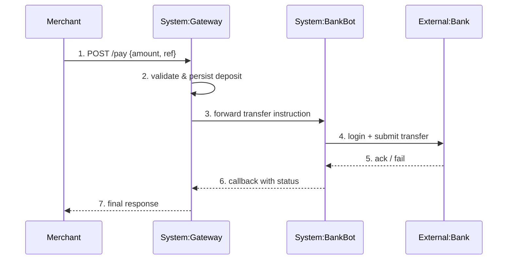

# Workflow 8 — Flow Map (behavior-level spec with sequence diagram)

> Reference document for the `pg-writer-oracle` instance of `technical_writer`.
> Read this file before running the workflow. Do not skim.

W8 sits at a different layer than W1/W2. Those are **code → doc** (code is truth, doc is a claim about code). W8 is **intent → code** (intent is the claim, code is the verification target). The direction of citation flips, and so does the discipline.

Output of a successful W8 pass: a markdown file in `docs/flows/<slug>.md` containing a mermaid sequence diagram plus prose, every numbered sequence step carrying an `// impl:` pointer (or `[UNIMPLEMENTED]`/`[DRIFT]` with a paired learning), a W8 trace in Oracle, and — for reverse-engineered flows — a `[RATIFICATION_PENDING:<threadId>]` header that stays in the doc until a human confirms the intent.

---

## When to run this workflow

Run when **any one** of:

- A human explicitly asks to document a flow ("document the payment flow", "เขียน flow OTP ให้หน่อย", "spec this").
- A PR body contains a `spec:` / `feat(flow):` / `flow:` marker asserting a new flow. The PR author's intent claim is the seed; W8 ratifies and records it.
- A W1 or W2 pass surfaced a code path that isn't covered by any existing `flows/*.md`.
- Monthly audit reveals an external-facing endpoint or scheduled job with no flow doc.

Do **not** run:

- To document an internal helper (belongs in `current-system.md`, not a flow).
- To describe a target-system flow (that's W3 when it exists).
- To edit an existing `flows/*.md` purely from code changes when authoritative claims exist — open an `arra_thread` against the ADR/claim first.
- When the claim source for a **new** flow is only a PR body with no ADR and no human thread answer — first seek a stronger claim (see §Claim strength hierarchy).

---

## Preconditions

- [ ] `git status --porcelain` empty.
- [ ] `docs/.baseline` exists and is parsable (W1 must have run).
- [ ] Oracle reachable (thread authoring required for reverse-engineered flows).
- [ ] At least **40 min** if reverse-engineering, **20 min** if transcribing from a ratified ADR/thread.
- [ ] You can name the flow in one sentence. If you cannot, the scope is too broad — split first.

---

## Inputs you will read

1. The named flow (slug + short description).
2. The claim source(s), in order of strength (§Claim strength hierarchy below).
3. `docs/current-system.md` sections covering the code path the flow traverses.
4. The Go/Node source files that implement each sequence step (for `// impl:` pointers and behavior verification).
5. Existing docs under `docs/flows/` (for house-style consistency).
6. Oracle — `arra_search` for prior `#flow` learnings; `arra_trace_list` for prior W8 traces on related flows.
7. Any open threads with `flow:<slug>` in the title.

---

## Outputs you will produce

Required:

- `docs/flows/<slug>.md` with all nine sections listed in §Document structure.
- Every numbered step in the mermaid diagram has either an `// impl: <path>@<short>` pointer **or** is explicitly marked `[UNIMPLEMENTED]` / `[DRIFT]` with a paired `arra_learn`.
- At least one `arra_learn` tagged `#flow + <slug>` with trace id.
- W8 root trace opened at Step 2b with `queryType="pattern"`; per-step children for every `[UNIMPLEMENTED]` / `[DRIFT]`.
- A one-line cross-link added to the relevant `current-system.md` section: `**Flow:** [<slug>](flows/<slug>.md)`.

Conditionally produced:

- `arra_thread`(s) for each open question (Step 7). For a **reverse-engineered** flow, one ratification thread is mandatory.
- A `#cross-repo-sync` learning when the flow spans bank-bot territory, naming the expected counterpart slug (bot-writer's W8 doesn't exist yet — this is a breadcrumb).
- `arra_supersede` against prior flow learning(s) when this pass revises an existing flow.

Never produced in this workflow:

- Code changes. Even typo fixes in comments. W8 is doc-only.
- A new ADR. If the flow requires an architectural decision, pause W8 and escalate to the decision-writer / human. W8 transcribes decisions, it doesn't make them.
- Duplicate content that should live in `current-system.md`. Flow docs describe *what the system does for the actor*; `current-system.md` describes *how the code is shaped*. Don't paraphrase one into the other.

---

## Document structure (the nine sections of `flows/<slug>.md`)

1. **Header** — slug, one-sentence purpose, claim-strength label (see §Claim strength hierarchy), ratification marker if reverse-engineered.
2. **Purpose** — one paragraph at the intent level. "Merchant completes a payment" **not** "HandlePay parses JSON and calls BankBot".
3. **Actors** — bulleted list. Each actor has a role tag: `User`, `System:<name>`, `External:<name>`. The same names must appear verbatim in the sequence diagram.
4. **Preconditions** — one line each. What must be true before the flow starts (auth state, data state, config).
5. **Sequence** — mermaid `sequenceDiagram`. Numbered messages (`1.`, `2.`, …). No more than ~10 actor-crossing messages.
6. **Success criteria** — observable and testable. "Merchant receives a callback with `status: paid`" **not** "system is happy".
7. **Error paths** — bulleted list. Each item names the error class + originating step + observable consequence.
8. **Postconditions** — state after successful completion. One line each.
9. **Implementation pointers** — per numbered step, a line linking the step to `path:line@commit-short`. `[UNIMPLEMENTED]` / `[DRIFT]` markers go here too, each with a paired learning link.

Headers at fixed casing. No decorative prose between sections. The document is both human- and agent-parseable (§W7 discipline applies here too).

---

## Steps

### Step 0 — Resolve answered threads in territory (blocking, 3–10 min)

Before opening any W8 work, run `references/workflow-thread-resolve.md` (Pass 1 + Pass 2) to completion.

- **Pass 1 (primary)** — `grep` for both `[AWAITING_THREAD:<id>]` and `[RATIFICATION_PENDING:<id>]` across pg-writer territory, with extra attention to `docs/flows/`. For `answered` threads, run the 4-step resolution block. **Ratification threads** (the `[RATIFICATION_PENDING]` variant) have an additional test in Step 2 of the resolution block: a neutral "looks good" answer is *insufficient* — require explicit engagement with the spec. Downgrade and follow up if the answer is vague.
- **Pass 2 (safety-net)** — `arra_threads(status="answered", limit=50)`; any pg-writer-territory id not seen in Pass 1 = leaked anchor → file `#workflow-bug + #thread-orphan`.

**Gate:** Step 1 does not start until Pass 1 = 0 answered markers and Pass 2 = 0 unfiled orphans. W8 is the workflow most likely to accumulate `[RATIFICATION_PENDING]` markers (every reverse-engineered flow spawns one), so Step 0 throughput directly determines how fast the flow portfolio graduates from "pending" to "ratified".

### Step 1 — Grounding (3 min)

```
arra_search query="technical-writer flow <slug>" type=all limit=10
arra_trace_list query="<slug>" queryType="pattern" limit=5
arra_threads status="answered" limit=10
```

If a prior W8 trace for this slug exists, this pass is a **revision** — use the existing `flows/<slug>.md` file and chain traces in Step 2b. Do not start a new file when one already exists; supersede its learnings, don't delete them (P-001).

### Step 2 — Identify the flow + claim source (5 min)

Write down (scratchpad or retro), before opening any diagram tool:

- **Slug** — kebab-case, stable identifier (`payment-merchant-checkout`, `otp-email-verification`, `withdrawal-dispatch`). Must match the filename.
- **Scope** — `single-repo` (mobiz only) or `cross-repo` (mobiz ↔ bank-bot). Cross-repo flows must be flagged for bot-writer follow-up even though bot-writer doesn't have W8 yet.
- **Actors** — the list you'll repeat verbatim in the diagram.
- **Is the flow new or existing?**
  - **New** — no code yet implements it (greenfield PR, anticipated behavior).
  - **Existing** — code already runs it; you're documenting after the fact.
- **Claim source(s)**, ranked from strongest available:
  1. ADR file path
  2. Human answer thread id
  3. PR / issue body + link
  4. Reverse-engineered from code

**Branching on source strength:**

- If the flow is **new** and the strongest claim is tier 3 or lower → **halt the W8 pass.** Open `arra_thread` citing the PR, ask the human to ratify the intent before the spec is authored. Authoring a new-flow spec from PR body alone leaves too much room for hallucinated semantics.
- If the flow is **new** and you have a tier-1 or tier-2 claim → proceed as **transcription**. The doc carries the strongest claim's strength label in its header. No ratification marker needed.
- If the flow is **existing** → proceed as **reverse-engineering allowed, but with a ratification thread**. Doc carries `[RATIFICATION_PENDING:<threadId>]` in its header (Step 7 opens the thread).

### Step 2b — Open the W8 root trace

```
arra_trace(
  query="flow-map — <slug>",
  queryType="pattern",
  scope="project",     # or "cross-project" if flow spans mobiz ↔ bank-bot
  project="github.com/kokarat/mobiz-payment-gateway",
  foundFiles=[
    { path: "docs/flows/<slug>.md", confidence: "high", matchReason: "authoring target", type: "other" },
    ...for each claim-source file (ADR, PR body saved to vault, code entry points)
  ]
)
# store returned trace_id as W8_TRACE
```

If revising an existing flow:

```
arra_trace_list(query="<slug>", queryType="pattern", limit=3)
arra_trace_link(prevTraceId="<prior W8 trace for this slug>", nextTraceId=W8_TRACE)
```

### Step 3 — Author Purpose / Actors / Preconditions (5 min)

- **Purpose** — one paragraph at intent level. Remove the paragraph mentally; could a reader still guess what the flow is from the rest? If yes, the purpose was empty; rewrite.
- **Actors** — bulleted list with role tags. If you cannot name an actor, it doesn't belong in the flow; cut it. The list must match the `participant` lines in the diagram exactly.
- **Preconditions** — one-liner per condition. Flag `[UNVERIFIED]` on any precondition you cannot ground in code or ADR. Do not guess.

### Step 4 — Draw the sequence diagram (10–15 min)

Use mermaid `sequenceDiagram`. Number every message. Keep to ~6–10 actor-crossing messages. Example:

````markdown

````

Rules:

- Numbered messages (1., 2., 3., …) become the anchors for implementation pointers in Step 5.
- **No more than 10 steps.** If the flow needs more, it's two flows — split and link them.
- **No internal helper calls.** Only actor-crossing messages. Internal calls live in `current-system.md`.
- Use `->>` for requests, `-->>` for responses. Use `self-messages` (e.g., `Gateway->>Gateway: ...`) sparingly and only for state transitions material to the flow.
- `participant <short> as <role-tagged-name>` — the short alias is for the diagram; the long name must match the Actors list.

### Step 5 — Implementation pointers + per-step child traces (10 min)

For each numbered step, add a pointer under `## Implementation pointers`:

```markdown
## Implementation pointers
- Step 1 → `routes/main.go:142@abc1234` // impl: POST /pay route
- Step 2 → `controllers/PayController.go:88@abc1234` // impl: validation + persist
- Step 3 → `helpers/bankbot.go:55@abc1234` // impl: ForwardToBankBot
- Step 4 → `[UNIMPLEMENTED]` — see `ψ/memory/learnings/2026-04-17_flow-<slug>-step-4-unimplemented.md`
...
```

For `[UNIMPLEMENTED]` steps — code does not cover the step claimed in the flow:

- File an `arra_learn` tagged `technical-writer + repo:mobiz-payment-gateway + current + drift + unimplemented + flow:<slug>`.
- Open a W8 child trace:

  ```
  arra_trace(
    query="flow-<slug> step <n> unimplemented",
    queryType="pattern",
    scope="project",
    project="github.com/kokarat/mobiz-payment-gateway",
    parentTraceId=W8_TRACE,
    foundLearnings=["ψ/memory/learnings/2026-04-17_flow-<slug>-step-<n>-unimplemented.md"]
  )
  ```

For `[DRIFT]` steps — code exists but diverges from the flow spec:

- File an `arra_learn` tagged `technical-writer + repo:mobiz-payment-gateway + current + drift + flow-divergence + flow:<slug>`. Source cite the divergent file.
- Open a W8 child trace with `parentTraceId=W8_TRACE` and `foundFiles` listing the divergent code.
- `[DRIFT]` is a W4 queue item. Do not try to fix the doc or the code in W8. Record and move on.

### Step 6 — Success criteria + error paths + postconditions (5 min)

- **Success criteria** — each bullet is observable (what a monitor or test could check) and traceable to the Step 5 pointers.
- **Error paths** — for each plausible failure: which step originates it, what the actors see, where the code handles it (pointer) or `[UNIMPLEMENTED]`.
- **Postconditions** — state after a successful run; one line each. Every postcondition should be verifiable from a data store or log.

### Step 7 — Open questions → `arra_thread` (varies)

For each ambiguity still standing after Steps 3–6:

```
arra_thread(
  title="flow:<slug> — <short question, ≤ 50 chars>",
  message="Context: authoring flows/<slug>.md
           Ambiguity: <cite + reading A vs reading B>
           Need: <what decides between them>
           Current placeholder: <what I wrote tentatively>"
)
```

Record each `threadId` inline in the doc as `[AWAITING_THREAD:<id>]` next to the affected claim.

**Ratification thread (reverse-engineered flows only).** Open one additional thread:

```
arra_thread(
  title="flow:<slug> — ratify reverse-engineered spec",
  message="I reverse-engineered docs/flows/<slug>.md at <commit-short> from code alone.
           No ADR or prior human claim exists. Please confirm the intent matches, or
           flag divergence. See [link to doc] + [link to W8_TRACE]."
)
```

Put the returned id in the doc header: `[RATIFICATION_PENDING:<threadId>]`. The marker stays until the thread is answered + the human confirms. A reverse-engineered flow with no ratification thread is worse than no flow doc at all — it dresses code up as authoritative intent.

### Step 8 — Cross-link to `current-system.md`

Find the `current-system.md` section whose code the flow crosses most heavily. Add a one-liner under that section's heading:

```markdown
> **Flow:** [`<slug>`](flows/<slug>.md) · `// impl-level`
```

The `// impl-level` marker signals to readers that the cross-link points to intent-level doc (W8), not another impl-level doc.

If the flow is cross-repo (touches bank-bot):

- File an `arra_learn` tagged `#flow + #cross-repo-sync + flow:<slug>` with body:
  > Flow `<slug>` crosses into bank-bot territory (steps N, M). Expected counterpart: `bank-bot/docs/flows/<slug>.md` (bot-writer W8 not yet implemented). When bot-writer runs W8 on this slug, `arra_trace_link(prev=<this W8_TRACE>, next=<bot W8 trace>)` should chain the two passes.

### Step 9 — Learn + finalize (5 min)

```
arra_learn(
  pattern="<one paragraph summarizing the flow's intent — not its implementation>",
  concepts=["technical-writer", "repo:mobiz-payment-gateway", "current", "flow", "<slug>"],
  source="docs/flows/<slug>.md@<new-short>",
  project="github.com/kokarat/mobiz-payment-gateway"
)
```

If this is a revision and a prior `arra_learn` for the same slug exists:

```
arra_supersede(
  oldId="<prior flow learning id>",
  newId="<new flow learning id>",
  reason="W8 revision pass <date>: <1-line what changed>"
)
```

### Step 10 — Commit + PR (3 min)

Branch: `docs/flow-<slug>`.

```
docs(flow): <slug> — <one-line purpose>

- New docs/flows/<slug>.md (<N> sequence steps, <M> impl pointers,
  <K> unimplemented, <D> drift)
- Cross-link from current-system.md §<n>
- <Z> open questions threaded
- [RATIFICATION_PENDING:<tid>] set (reverse-engineered) OR not-applicable (transcribed)

No code behavior changes.
```

PR body must include:

- Link to the flow doc.
- Link to each open thread.
- Ratification-thread link (if reverse-engineered), clearly labelled as *required before this doc is authoritative*.
- The literal line: **"I will not merge this PR. Awaiting human review + thread resolution."**

### Step 11 — Retrospective (5 min)

`rrr` to `~/.arra-oracle-v2/ψ/memory/retrospectives/YYYY-MM/DD/HH.MM_flow-<slug>.md`.

**AI Diary** must cover:

- Claim-source tier actually used.
- Transcription vs reverse-engineering mode.
- Count of `[UNIMPLEMENTED]` / `[DRIFT]` steps.
- Open thread ids including the ratification thread.

**Honest Feedback** must answer:

- Was the flow boundary clear, or did scope creep across into a neighboring flow?
- Are numbered sequence steps actually usable for impl pointers, or did a step aggregate too much?
- Did Mermaid help or fight the diagram? Any step you wanted to express that Mermaid couldn't?
- Should this flow have been split into sub-flows?

---

## Claim strength hierarchy

From strongest to weakest. A flow doc carries the weakest strength of any claim it contains — one reverse-engineered step drags the whole doc down to S4.

| Tier | Source | How to cite in the doc |
|---|---|---|
| S1 | Committed ADR | `// per-adr: docs/adr/NNNN-title.md` |
| S2 | Human-ratified thread answer | `// verified-via-thread: <id>` |
| S3 | PR body / issue body (intent claim) | `// per-claim: PR#<n>` |
| S4 | Reverse-engineered from code | `// reverse-engineered: <path>@<short>` — doc carries `[RATIFICATION_PENDING:<thread>]` header |

Header of the doc records the aggregate strength label: `Claim strength: S1 (all steps ADR-grounded)` / `Claim strength: S4 (reverse-engineered; ratification pending <thread>)` / etc. This is not decoration — downstream agents route by this label.

---

## Definition of Done

- [ ] `docs/flows/<slug>.md` exists with all nine sections.
- [ ] Mermaid diagram parses (GitHub PR preview shows the rendered diagram; if not, fix before pushing).
- [ ] Every numbered diagram step has an `// impl:` pointer **or** `[UNIMPLEMENTED]` / `[DRIFT]` marker with a paired learning link.
- [ ] Claim-strength label in the doc header matches the weakest individual claim.
- [ ] At least one `arra_learn` tagged `#flow + <slug>` landed.
- [ ] W8 root trace opened (Step 2b) with `queryType="pattern"`; every `[UNIMPLEMENTED]` / `[DRIFT]` has a child trace with `parentTraceId=W8_TRACE`.
- [ ] If revising, `arra_trace_link(prev, next)` called; `arra_supersede` called for superseded learnings.
- [ ] `current-system.md` has a one-line cross-link to the new flow doc.
- [ ] Reverse-engineered flows: ratification thread opened, `[RATIFICATION_PENDING:<id>]` in doc header.
- [ ] Cross-repo flows: `#cross-repo-sync` learning filed with expected bot-writer counterpart slug.
- [ ] Branch pushed, PR opened; **not merged**.
- [ ] Retrospective written (AI Diary + Honest Feedback, mandatory).
- [ ] `arra_handoff` entry with PR pointer + open thread ids + ratification thread id.
- [ ] Vault audit clean: `bash $(ghq list -p kxlahsimx09/mb_agent_oracle_memory)/scripts/verify.sh | grep -A 3 frontmatter` shows `✅ no double-wrap` + `✅ every indexed doc has a title:`.
- [ ] Step 0 ran to completion: Pass 1 (doc-anchored grep, including `[RATIFICATION_PENDING]`) left zero `answered`-status markers in pg-writer territory; Pass 2 (orphan scan) returned zero unfiled orphans. Any ratification thread whose answer was judged insufficient stays open with a follow-up message — not closed prematurely.
- [ ] **Anchor discipline**: every `arra_thread(...)` call in this pass (both question threads and the mandatory ratification thread for reverse-engineered flows) inserted a paired `[AWAITING_THREAD:<id>]` or `[RATIFICATION_PENDING:<id>]` marker into `docs/flows/<slug>.md` in the same PR. Orphan thread count = 0. Count check: `grep -cE '\[(AWAITING_THREAD|RATIFICATION_PENDING):' docs/flows/<slug>.md` in the PR diff ≥ count of `arra_thread(` calls recorded in the retro.

---

## Common pitfalls

- **Describing code, not intent.** A flow doc that reads like a paraphrased `current-system.md` is worthless. Test: delete every `// impl:` line; does the prose still describe *what the system does for the actor*? If it becomes gibberish, you wrote code-level prose — rewrite.
- **Diagram granularity wrong.** 3 steps = useless; 20 = drowning in internals. Aim 6–10 actor-crossing messages.
- **Silent reverse-engineering.** Building a flow from code alone and not flagging `[RATIFICATION_PENDING]` is worse than no doc — it launders a guess into authority.
- **Forgetting cross-repo.** Payment and OTP flows almost always span mobiz ↔ bank-bot. File the `#cross-repo-sync` learning now; it's the breadcrumb for bot-writer's future W8.
- **Diagram-only doc.** The diagram summarizes; the prose disambiguates. A flow doc without error paths and postconditions is a wireframe.
- **Mixing tiers without labelling.** If step 5 is S4 and the rest is S1, the aggregate strength is S4. Do not average; do not hide.
- **Inventing a ratification.** Do not close `[RATIFICATION_PENDING]` yourself after the thread answers if the human's answer raised new questions — open a follow-up thread first.

---

## Escalation

- **Security-sensitive flow** (auth, OTP, JWT, callback verification, RBAC, MDR code changes) → open the ratification thread **and** CC `security_auditor`. `[RATIFICATION_PENDING]` does not drop until both sign off.
- **Financial flow** (wallet ops, settlements, fees, payouts) → CC `code_reviewer` on the PR.
- **Flow cites an ADR that's missing/absent** → do not invent. Open thread, file `#missing-adr` learning tagged with the slug.
- **Cross-repo flow where bank-bot code contradicts the mobiz-side claim** → do not silently accommodate bank-bot behavior. File `#drift` against whichever side diverges from the ratified claim; let W4 resolve.
- **Oracle unreachable for threading** → degrade to inline `[UNVERIFIED]` + `arra_inbox` handoff + retro note. Do not proceed past Step 7 without threads on a reverse-engineered flow.

---

## Relationship to other workflows

- **Before W8**: W1 must have produced a valid `current-system.md` and a current `.baseline`. Without them, `// impl:` pointers have nothing to resolve against.
- **W8 output feeds W4**: every `[UNIMPLEMENTED]` or `[DRIFT]` step is a W4 queue item. Do not attempt to reconcile in W8.
- **W2 may spawn W8**: if a commit range reveals a flow not yet documented, file a `#flow` learning queueing W8 as a follow-up. Do not inline the W8 work into W2 — they have different verification models.
- **W8 ≠ ADR**: an ADR justifies a decision; a flow doc describes behavior. Ratified flows cite the ADR; they don't replace it.
- **W8 does not describe target system**: that's W3 when it exists. If a current-system flow has a target counterpart that `next-writer` must mirror, file `#repo:cross + #flow + #migration-map` so the sibling instance picks it up via search.

---

## Change log for this workflow file

- 2026-04-17 — Initial version. Scoped to `pg-writer-oracle` only (mobiz-payment-gateway pilot); bot-writer does not have W8 yet. Mermaid-only diagrams. Hybrid authorship per human decision: strict transcription required for **new** flows (tier S1/S2 claim mandatory); reverse-engineering allowed for **existing** flows but gated by a `[RATIFICATION_PENDING]` thread. `queryType="pattern"` for the W8 root trace. Per-step children for `[UNIMPLEMENTED]`/`[DRIFT]` (like W1). Claim-strength label in the doc header so downstream agents route by trust level.
- 2026-04-17 (later) — Added **Step 0 (Resolve answered threads in territory)**. Motivation observed during the first W8 run: agent opened a thread, human answered, next session didn't consume the answer — and the thread never closed. Fix: doc-anchored Pass 1 + orphan-scan Pass 2 (see `workflow-thread-resolve.md`). Ratification-thread answers get a stricter test — a neutral "looks good" is insufficient; the human must engage with the spec. DoD added: Step 0 clears to zero, and every `arra_thread(...)` inserts a paired marker (anchor discipline).
