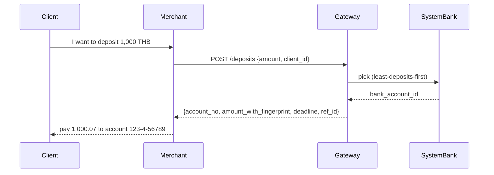

# Workflow 1 — author-requirement

> Translate ratified architectural inputs into one human-readable epic file with stories that downstream roles (designer, dev, tester) can lift verbatim.

**Inputs (priority order, per SKILL.md):**

1. New-system ratified artifacts: `docs/adr.md` ratified ADRs, `docs/design/<subsystem>/`, `poc/<adr-id>/` `#poc-ready` PoCs, vault learnings tagged `#decision` / `#poc-ready`.
2. Current-system ground truth: pg-writer / bot-writer flow docs, ratified vault learnings, Mongo collections (`mcp__dpay__*`).
3. Current-system code (smoke only, S4): `mobiz-payment-gateway/services/`, `mobiz-payment-gateway/routes/`, `bank-bot/src/`. Use only when 1 & 2 are silent.
4. Humans via `arra_thread` when sources conflict or are silent.

**Output:** one file at `docs/requirements/epic-<slug>.md` (≤ 250 lines) plus updates to `docs/requirements/INDEX.md` and `docs/requirements/glossary.md` if new terms appear. One `arra_learn` per pass with mandatory 3-layer tagging.

---

## Steps

### Step 0 — Sweep open threads + drift

Before authoring, check for unresolved feedback that affects this epic:

```
arra_search query="<subsystem> drift" type=learning limit=10
arra_search query="<subsystem> AWAITING_THREAD" type=all limit=5
arra_thread_list status=open  # threads I own or am addressed in
```

If a `#poc-drift` learning post-dates a previously-ratified ADR, the story drawn from that ADR may need a `[S3 provisional]` downgrade or an `arra_supersede` chain. Note these in a working list before Step 1; never ignore drift between sweeps and authoring.

### Step 1 — Source-sweep for the epic's subsystem

Run all four pre-reads from SKILL.md "Memory discipline" section. List every:

- Ratified ADR id (and which sub-section) with `#decision` and *not* `#provisional`.
- `#poc-ready` learnings whose `<adr-id>` matches the epic's ADRs.
- Current-system flow doc(s) on the same subsystem (pg-writer / bot-writer ratified).
- Mongo collection(s) that hold the ground-truth shape.

Output the list in your scratchpad. Do **not** start writing until the list is closed and every item is reachable. If anything is "I think this exists somewhere" — go find it before writing.

### Step 2 — Draft the epic outline

The outline lists the stories you intend to write before you write any of them. Each line:

```
EPIC-<slug>-<NNN>  <one-line summary>  [trust-projection]  → <primary source>
```

Trust projection is your best guess of the final trust label, so you notice if half the stories in an epic are S4 (you have a sourcing problem to fix before authoring).

The outline is checked against the source list from Step 1: every story must have ≥ 1 source from that list. If not, either drop the story or open a thread to fill the gap.

### Step 3 — Author each story (the load-bearing step)

Per story, in this order:

1. **Heading** with story id + one-line summary + trust label:
   ```
   ### DEPOSIT-003 — Merchant requests a deposit and gets a bank account to pay to  [S2 ratified]
   ```
2. **As-a / I-want / So-that** — one paragraph, plain English, no ADR ids in the body.
3. **User journey** (if multi-actor) — numbered steps + a mermaid sequence diagram. Skip for single-actor stories; prose alone is fine.
4. **Acceptance criteria** in Given/When/Then. One criterion per real concern; testers should be able to lift them verbatim. The criterion must stand alone without reading the ADR.
5. **Edge cases & open questions** — bullet list. Anchor `[AWAITING_THREAD:<id>]` for anything unresolved; do not block the story.
6. **Sources block** (mandatory — no story ships without it; see SKILL.md "Trust labels and Sources block — exact shape").

**Plain-English discipline:** if a sentence in the body uses an internal codename ("RPC", "advisory lock", "pg_cron"), rewrite it. Those terms belong in the Sources block's link target, not in the story body. The body is for a stakeholder reading on their phone.

### Step 4 — Cross-link glossary

Every domain term used for the first time in this epic gets a glossary entry. Open `docs/requirements/glossary.md`, append the term + a one-paragraph plain-English definition + a Sources block (same shape as a story). Then in the epic body, link the first occurrence: `[deposit](glossary.md#deposit)`.

If `glossary.md` does not exist yet, this is the first epic — create it with a header and one entry per term used.

### Step 5 — Update INDEX

Append every new story to `docs/requirements/INDEX.md` in the flat list:

```
- DEPOSIT-003 [S2] Merchant requests a deposit and gets a bank account to pay to
```

This file is the agent-friendly handoff surface — downstream roles `grep` it for "what stories exist" without reading every epic file.

### Step 6 — Cross-repo coordination check

If the epic's stories cross into another next-* repo (today: bankbot v2, future: anything else), append a row to `docs/requirements/cross-repo.md` capturing the boundary contract: which side owns the data, which side owns the API surface, who calls whom. Cite the ADR or design doc that pins the contract.

If no cross-repo coordination is needed, skip this step and note "single-repo" in the epic's frontmatter.

### Step 7 — File `arra_learn` for the pass

One `arra_learn` per epic-authoring pass. Pattern (no leading frontmatter — per SKILL.md write discipline):

```
epic authored — <epic-slug> — <N stories>, trust mix S2/S3/S4 = a/b/c.

Subsystem: <slug>
Sources cited: <ADR ids>, <PoC paths>, <flow doc paths>, <mongo collections>
Open threads: [AWAITING_THREAD:<id>] × N (if any)
File: docs/requirements/epic-<slug>.md@<commit>
```

Tags (mandatory 3-layer + features):

```
- next-product-writer
- repo:mb-next-payment-gateway   # or repo:cross when stories span repos
- next
- requirement
- epic
- <subsystem>                     # withdrawal-lane, deposit-auto-expire, etc.
- s2-ratified | s3-provisional | mixed-trust
```

`source:` `docs/requirements/epic-<slug>.md@<commit>`.
`project:` `github.com/kxlahsimx09/mb-next-payment-gateway`.

### Step 8 — Open the PR (Vercel deploys automatically)

The docs hub at `mb-next-docs.vercel.app` is wired to the GitHub
integration on `main`: every push to `main` triggers a Vercel build
+ deploy automatically (Root Directory = `docs-site/`, "Include source
files outside the Root Directory" = ON, so the build's `prebuild`
hook can read `../docs/requirements/`). The agent does **not** run
`vercel deploy` directly — the human's PR-merge IS the deploy
gate.

So the workflow's exit step is just:

```bash
cd <product-repo>
git checkout -b writer/<epic-slug>-<short-suffix>
git add docs/requirements/
git commit -m "next-writer: <epic-slug> — <N stories>, S<trust-mix>"
git push -u origin writer/<epic-slug>-<short-suffix>
gh pr create --base main --head writer/<epic-slug>-<short-suffix> \
   --title "next-writer: epic-<slug> — <N stories>" \
   --body "..."   # link to the arra_learn id from Step 7
```

Important PR-body conventions for this role:

- Cite the `arra_learn` id from Step 7 so reviewers can pull provenance from the vault.
- Include the **trust-mix** (e.g. "3×S2, 1×S3") so reviewers see at a glance how settled the epic is.
- List sources cited (ADR ids, PoC paths, flow doc paths, mongo collections) in a "Sources" section.
- Flag any open `[AWAITING_THREAD:<id>]` so they don't get lost in review.
- Mention which existing files are touched (always at least `epic-<slug>.md` + `INDEX.md` + maybe `glossary.md` + maybe `cross-repo.md`).

After the human merges:

- Vercel auto-builds from `main` (~1-2 minutes).
- The new epic appears at `mb-next-docs.vercel.app/epic-<slug>` immediately after the deploy turns Ready.
- A `_pagefind` re-index runs on every build, so search picks up the new content.

If the agent wants to preview a deploy *before* merge, Vercel's GitHub
integration also creates a Preview deployment per PR — its URL is in
the PR's automated "Vercel" check at the bottom of the GitHub PR page.
The agent can paste that URL into the PR description for the human's
visual review.

**Optional escape hatch** (rarely needed): if Vercel's git integration
is unavailable for some reason, `docs-site/scripts/vercel-bootstrap.sh`
+ `npm run vercel:deploy` can deploy directly via the Vercel CLI —
but this requires the human to first populate
`mb_agent_oracle_memory/.vercel-projects/mb-next-payment-gateway-docs.json`
with the link metadata (see `docs-site/README.md`). Use this only when
git integration is broken; default is "open PR, let main-deploy fire".

### Step 9 — Retro

Close the session with `rrr` (per AGENTS.md §10). The retro lives at `ψ/memory/retrospectives/YYYY-MM/DD/HH.MM_w1-author-<epic>.md`. AI Diary + Honest Feedback are mandatory. Specifically capture:

- Which sources were richest? Which were silent?
- Did any story end up `[S4 reverse-engineered]` because nothing else covered it? That is a hint to the architect that an ADR is missing.
- Did any cross-repo boundary surface that wasn't anticipated? Capture for `cross-repo.md`.
- Was the PR opened cleanly with all the expected sections (trust-mix, sources, awaiting-thread flags)? Surface any template gaps for the next pass.

---

## Anti-patterns (binding don'ts)

- **Don't write a story without a Sources block.** Half-finished requirements are worse than none — they leak into design and test as if they were ratified.
- **Don't paraphrase ADR text into the story body.** The body is product-facing English; the link to the ADR is in Sources. If the human can't read the story without ADR context, the story is in the wrong voice.
- **Don't invent trust.** A story drawn only from current-system code is `[S4]`, not `[S2]`. Even if you are confident the next system will preserve the behavior, until an ADR ratifies it the trust label stays low.
- **Don't claim "X's wallet/balance/state is updated" without verifying which discriminator** (e.g. `owner_type`) the underlying code filters on. Reverse-engineering from a change-log collection alone (e.g. `wallets_change_logs`) is misleading because secondary effects (MDR distribution to partners) can outnumber the primary effect (client credit) and skew the inferred shape. Pre-flight: a Mongo aggregate by the discriminator + a code-line read of the function that does the update + a search of `pg-writer`/`bot-writer` drift learnings for past actor-rename corrections. Lesson learned the hard way 2026-05-07 on `epic-deposit` DEPOSIT-002 — see vault learning `2026-05-07_correction-deposit-credit-target-is-client-wal`.
- **Don't use kramdown-style heading anchors `{#anchor-id}` in story or epic files.** GitHub-flavored Markdown supports them, but MDX (used by Nextra v4 to render the docs hub) interprets `{...}` as a JSX expression and the build fails on `Error compiling`. Either: (a) keep heading text short enough that Nextra's auto-slug from the heading text is itself the stable id you want (e.g. `## DEPOSIT-001` → slug `deposit-001`), and put the trust label + one-line summary in a paragraph below the heading; or (b) drop a self-closing HTML anchor right above the heading: `<a id="deposit-001" />`. Default to (a) — it doubles as cleaner table-of-contents. Lesson learned 2026-05-07 when `docs-site/` first deploy on Vercel failed with this exact pattern.
- **Don't write `{...}` outside backticks anywhere in the body, including Sources blocks.** MDX evaluates *every* `{...}` outside fenced code or inline code as a JSX expression — so `{client, partner}`, `{status=pending, expires_at}`, `{owner_type=merchant}`, even `{a, b}` get treated as JS and explode at prerender time with `ReferenceError: <name> is not defined` (digest changes each iteration; this one bit on the second build, 2026-05-07). Always wrap data shapes, set notation, and pseudo-code in backticks: `` `{client, partner}` ``. The author's eye scans markdown for `{#...}` (the kramdown trap) but misses `{a, b}` set notation — pre-flight your file by piping it through this regex before pushing: ``rg -nP '(?<![\`\\\\])\{[^}\`]+\}' docs/requirements/*.md | grep -v '\\\\.md:[0-9]*: *\\\\` '`` (zero hits = clean). Examples that survived past human review and bit on Vercel: ``mongo collections `wallets` (owner_type ∈ {client, partner} — verified count: ...)`` ← `{client, partner}` is bare here because the `wallets` backtick already closed.
- **Don't write epics for unscoped subsystems.** If the architect has not produced an ADR for "feature X", do not pre-write epic-x.md "to save time later." The story will drift from the eventual ADR; cleanup is more expensive than re-authoring after ratification.
- **Don't extend `pg-writer`'s lane.** The current system is pg-writer / bot-writer's home. If a current-system flow doc is missing or wrong, file `arra_learn #drift #current-doc-gap` for them — do not write into `mobiz-payment-gateway/docs/`.
- **Don't merge ADR amendments into existing stories silently.** Amendments → revision-log entry + `arra_supersede` of the old story id, with a pointer.

---

## Worked-example skeleton (for reference)

```markdown
# Epic: Deposit  (subsystem: deposit-auto-match + deposit-auto-expire)

> A merchant's client pays into the system; the gateway credits the merchant's wallet
> within seconds when a matching bank statement arrives, or auto-expires the request
> if no payment lands within the configured window.

## Stories

### DEPOSIT-001 — Merchant client requests a deposit  [S2 ratified]

**As a** merchant client, **I want** to request a deposit by amount, **so that** I receive
a bank account number to pay to and a deadline.

**User journey:**
1. Client calls the merchant's storefront with intent to top up.
2. Merchant calls gateway `POST /deposits` with amount + client id.
3. Gateway picks a system bank account using fair-rotation (least-deposits-first).
4. Gateway returns: bank account number, expected amount (with fingerprint cents),
   deadline (default 15 min), reference id.
5. Client transfers from their personal bank to the returned account.



**Acceptance criteria:**
- *Given* the merchant has at least one active system bank in their pool,
  *when* they call `POST /deposits` with a positive amount,
  *then* the response includes a bank account number, fingerprinted amount, and a
  deadline ≥ 5 minutes in the future.
- *Given* no system bank in the merchant's pool is active,
  *when* they call `POST /deposits`,
  *then* the response is a 503 with `code: NO_BANK_AVAILABLE`.

**Edge cases:**
- Concurrent requests must not over-allocate the same bank if its rotation cap is
  near. Verified by `poc/4b/` deterministic mutation tests. [AWAITING_THREAD:none]

**Sources:**
- new:adr        §ADR-4 (decoupled processing) — docs/adr.md
- new:adr        §ADR-4b (deposit auto-match) — docs/adr.md
- new:design     docs/design/deposit-auto-expire/README.md
- new:poc        poc/4b/ (poc-ready, 2026-05-06)
- new:learning   2026-05-06_poc-ready-adr-4b-d5-atomic-finalizedeposit-d2
- old:flow       mobiz docs/flows/deposit-request.md (ratified)
- old:data       mongo collection: ts_deposits, system_banks
- old:code       mobiz services/bankRotation.go (S4, smoke only)
```

---

**Created:** 2026-05-07 (GMT+7).
**Owner:** maintained by `next-product-writer` itself; changes require a commit on `mb_agent_oracle_memory`.
